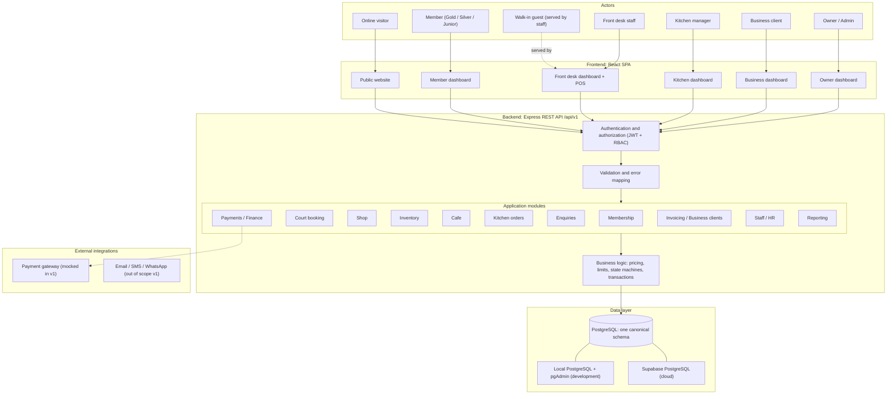
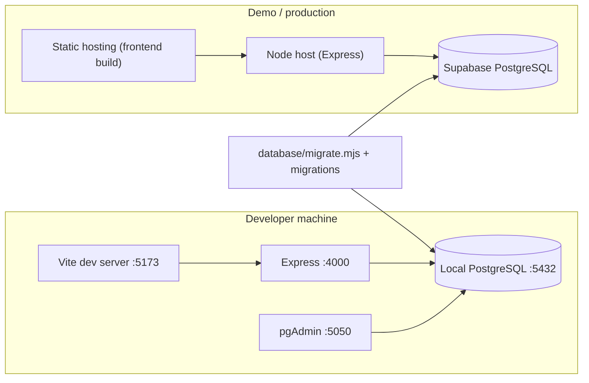

# System Architecture — The Champions Club

> Status: **blueprint (pre-implementation)**. Everything here is binding for the four developers. Diagrams: [system-architecture.mmd](system-architecture.mmd) (generated from the first diagram below). Decisions: [ADRs](../decisions/README.md). Assumptions: [ASSUMPTIONS.md](../ASSUMPTIONS.md).

## 1. Goal and shape

One platform replaces WhatsApp bookings, Excel member lists, paper bar receipts, phone availability checks and "no visibility" with: a **public website**, **five role-based dashboards**, and a **single PostgreSQL database** behind a **single REST API**. A modular monolith — one backend process, one database, strict module boundaries — is the right size for 12 hours and 4 developers (ADR-008).

## 2. Layered architecture



**Rules of the layers**

| Layer | Responsibility | May call | Must not |
|---|---|---|---|
| UI | Render, collect input, call API | `api/<module>.ts` only | contain pricing/limit logic; talk to the DB; re-declare shared types |
| Auth + validation | Identify caller, check role, validate shape | modules | contain business rules |
| Module routes | Map HTTP ↔ service | own service | run SQL |
| Module service | Business rules, transactions, state machines | own repo, other modules' **services** (§5) | read/write another module's tables |
| Repo | SQL for the module's own tables | `kernel/db` | enforce authorisation |
| Database | Final guarantees: constraints, exclusion, checks | — | be bypassed by "just this once" scripts |

## 3. Actors and roles

Exactly **five** login roles (`USER_ROLE`); the other two actors need no role.

| Actor | Identity | Dashboard / entry | Notes |
|---|---|---|---|
| Online visitor | none | public website | can enquire / request a trial; sign up → becomes MEMBER |
| Walk-in guest | none (`guest_name`, `guest_phone` on records) | served by Front Desk | books, buys, orders, pays cash/card/UPI |
| **MEMBER** | `users.role = MEMBER` + `members` row | `/member` | **Gold / Silver / Junior are not roles**: they are `membership_plans.membership_type`, attached via `memberships`. Benefits are data. |
| **FRONT_DESK** | `users` + `staff` | `/front-desk` | registers members, bookings, the enquiry inbox, runs the shop counter and cafe orders, sees schedules |
| **KITCHEN_MANAGER** | `users` + `staff` | `/kitchen` | kitchen board only: incoming → preparing → ready → served |
| **BUSINESS_CLIENT** | `users` + `business_clients` | `/business` | invoices, payments, transaction history |
| **OWNER_ADMIN** | `users` + `staff` | `/owner` | everything: products/stock, plans, courts, menu, finance, invoices, staff/HR, leave approval, reports, settings |

There is deliberately **no Shop Staff role** (shop/inventory = Owner; counter sales = Front Desk) and **one** kitchen role (ADR-003).

## 4. Modules

| Module (API) | Responsibility | Primary tables | Owner |
|---|---|---|---|
| `auth` | signup, login, session, password | `users` | Dev 1 |
| `public` | public club info | `club_settings` | Dev 1 |
| `enquiries` | the enquiry inbox (contact and trial requests, handled or not) | `enquiries` | Dev 1 |
| `members` | member profile, search, history timeline, desk registration | `members` (+`users`) | Dev 2 |
| `memberships` | plans, purchase/renew/change/cancel | `membership_plans`, `memberships` | Dev 2 |
| `courts` | catalogue, availability grid, maintenance blocks | `courts`, `court_bookings` (read) | Dev 2 |
| `bookings` | booking engine: pricing, limits, conflicts, cancellation | `court_bookings` | Dev 2 |
| `shop` | catalogue, orders (counter + online, pickup/delivery) | `products`, `shop_orders`, `shop_order_items` | Dev 3 |
| `inventory` | stock levels, adjustments, low-stock | `products.stock_quantity` | Dev 3 |
| `bar` | cafe menu, orders, daily summary | `bar_menu_items`, `bar_orders`, `bar_order_items` | Dev 3 |
| `kitchen` | kitchen projection + status transitions | `bar_orders` | Dev 3 |
| `payments` | the payment/refund engine and revenue ledger | `payments` | Dev 4 |
| `invoices` / `clients` | business clients, invoices | `business_clients`, `invoices`, `invoice_items` | Dev 4 |
| `staff` | employees, shifts, leave, payroll | `staff`, `staff_shifts`, `leave_requests`, `payroll_payments` | Dev 4 |
| `reports` | owner dashboard, revenue, tax, exports | reads everything via SQL | Dev 4 |
| `settings` | club policy values | `club_settings` | Dev 4 |

(Full ownership incl. UI: [OWNERSHIP_MAP.md](../integration/OWNERSHIP_MAP.md).)

## 5. Internal service contracts

These are the **only** allowed cross-module calls. Each is implemented by the owner and published as a stub in **hour 1** so others can code against it. Signatures are TypeScript for precision; `tx` is the open DB transaction passed down so a multi-module operation commits or rolls back as one.

| Provider | Contract | Used by |
|---|---|---|
| **Kernel (Dev 1)** | `withTransaction(fn)`, `AppError(code, details)`, `ok()/created()/page()`, `requireAuth`, `requireRole(...)`, `callerScope(req) → { member_id? \| staff_id? \| business_client_id? }` | everyone |
| **Kernel (Dev 1)** | `SettingsService.get<T>(key: SettingKey): Promise<T>` (read-only, cached 30 s) | everyone |
| **Dev 2** | `MembershipService.getEffectiveMembership(tx, member_id, on_date): Promise<{ membership, plan } \| null>` — the membership whose `[start_date,end_date]` contains `on_date` and `cancelled_at IS NULL` (status is derived from dates, never stored); **null ⇒ walk-in pricing** | bookings, social, shop, bar, memberships |
| **Dev 2** | `MembershipService.discountPercent(plan \| null, area: 'COURT' \| 'SHOP' \| 'BAR'): Percent` | shop, bar, bookings |
| **Dev 2** | `MembershipService.purchase(tx, { member_id, membership_plan_id, method, by_user_id }): { membership, payment }` | enquiries (convert), members (register) |
| **Dev 2** | `MembersService.register(tx, input): { user, member }` | enquiries (convert) |
| **Dev 2** | `BookingService.createTrial(tx, { enquiry_id, court_id, start_at, by_user_id })` | enquiries (trial booking) |
| **Dev 2** | `BookingService.playsUsedOn(tx, member_id, ist_date): number` (REGULAR bookings that stand) | bookings |
| **Dev 4** | `PaymentsService.record(tx, { source_type, source_id, amount?, method, received_by_user_id?, gateway_reference?, notes? }): Payment` — loads the source through its **adapter**, validates amount, derives category/tax, inserts the ledger row, the payment status of the source is derived by the *_totals views, nothing is written back | bookings, memberships, shop, bar, invoices |
| **Dev 4** | `PaymentsService.refundSource(tx, { source_type, source_id, reason, by_user_id, amount? })` — refunds the source's payments (full by default) | bookings/shop/cafe cancellation flows |
| **Dev 4** | `registerPaymentSource(adapter)` where `adapter = { source_type, load(tx,id) → { gross_due, already_paid, payer: {member_id?, business_client_id?, payer_name?}, revenue_category, tax: { rate_key } }, onPaid(tx,id,{ paid_total, fully_paid }), onRefunded(tx,id,{ refunded_total }) }` — **each source owner writes the adapter for their own tables**; Dev 4 never touches their tables | each owner for their `PAYMENT_SOURCE_TYPE` |

Adapter ownership: `COURT_BOOKING` → bookings (Dev 2), `MEMBERSHIP` → memberships (Dev 2), `SHOP_ORDER` → shop (Dev 3), `BAR_ORDER` → bar (Dev 3), `INVOICE` → invoices (Dev 4).

**Rule of thumb:** if your code would `JOIN` a table owned by someone else to *make a decision* (discount, availability, balance), call their service instead. Read-only reporting queries (`reports`, member history timeline) are the one sanctioned exception.

## 6. Request lifecycle

```
HTTP → CORS → request-id → JSON body → requireAuth (JWT → req.user) → requireRole(roles of the endpoint)
     → validate(zod, from generated Request/Query types) → route handler
     → service (BEGIN) → repo SQL … → other modules' services (same tx) → COMMIT
     → ok()/created()/page() envelope      |  throw AppError(code) → error middleware → { success:false, error:{code,message,details} }
```
Unknown errors become `INTERNAL_ERROR` (logged with stack, generic message to client). Database errors are mapped by SQLSTATE in `kernel/db.ts` (see [ERROR_CODES.md](../contracts/ERROR_CODES.md)).

## 7. Data architecture (summary — details in [DATABASE_SCHEMA.md](../database/DATABASE_SCHEMA.md))

- **One schema**, applied by numbered migrations to local Postgres and Supabase Postgres identically (ADR-001).
- **Integrity in the database:** exclusion constraint for court overlap, `CHECK (stock_quantity >= 0)`, an exclusion constraint (no two live membership terms of one member overlap), a partial unique index (one JOINED row per member per session), enums, FK everywhere.
- **Ledgers:** `payments` (all money in). Reports aggregate the ledger; derived values (amounts due, payment status, membership status, revenue category) come from SQL views, nothing is recomputed from guesses.
- **Snapshots:** prices, names and the membership used for a discount are copied onto bookings/orders.
- **Time:** timestamps UTC; business logic by IST date via `shared/lib/time.ts`. **Money:** `numeric(12,2)` ⇄ 2-decimal strings via `shared/lib/money.ts`.

## 8. Cross-cutting concerns

| Concern | Decision |
|---|---|
| Authentication | Email + password → bcrypt → backend-issued JWT (HS256, 8 h). No Supabase Auth, so local and cloud behave identically (ADR-002). |
| Authorisation | Role per endpoint + own-record scoping ([PERMISSIONS_MATRIX.md](../security/PERMISSIONS_MATRIX.md)). |
| Validation | zod at the edge, shaped by `shared/types/requests.generated.ts`. |
| Transactions | One `withTransaction` per use case. Advisory lock per member for the daily-limit check. |
| Concurrency | Court overlap → DB exclusion. Stock → atomic conditional `UPDATE`. Overlapping membership terms → DB exclusion. |
| Background work | None required: membership status, booking status and invoice overdue are derived from dates by SQL views (ADR-016). |
| Real-time | Polling only (kitchen 5 s) — no websockets in the hackathon build (ADR-010). |
| Payments | `PaymentsService` + adapters; `ONLINE` method handled by a mock gateway (ADR-011). |
| Logging | request id on every log line; no secrets or password hashes in logs. |
| Config | validated env at start-up ([ENVIRONMENT.md](../integration/ENVIRONMENT.md)). |

## 9. Deployment topology



The same `database/migrations/*.sql` reach both databases through the same script. The browser talks **only** to the Express API; it never talks to Supabase directly.

## 10. External integrations (and what we do instead in 12 hours)

| Integration | v1 | Seam kept for later |
|---|---|---|
| Online payment gateway | **Mock** gateway: instant success, returns `RZP-…` style reference; failure simulated with amount ending `.13` (for demo of `PAYMENT_FAILED`) | `PAYMENT_PROVIDER` env + `gateway.ts` interface |
| Email / SMS / WhatsApp | none — no notification system (ADR-016) | add a notification table or a mail hook later |
| Maps / delivery tracking | none (address text only) | — |
| PDF invoices / receipts | print-friendly HTML page | — |

## 11. Simplifications allowed under time pressure (nothing is removed — see priorities in [REQUIREMENTS.md](../requirements/REQUIREMENTS.md#6-hackathon-priority-summary))

- Booking `PENDING` holds (payment-pending expiry) → create directly as `CONFIRMED`; payment may remain `PENDING` for desk payment.
- Reports → compute on request with plain SQL; no caching or materialised views.
- Export → CSV only. Receipts → HTML.
- Everything with priority NICE.
