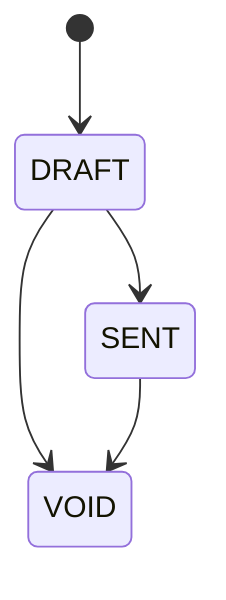
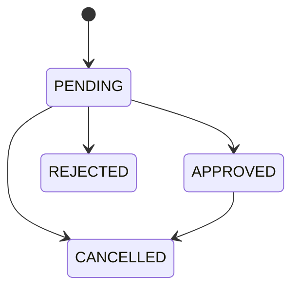
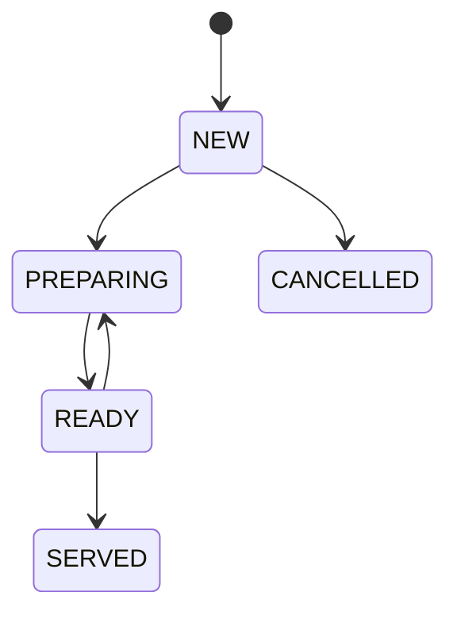
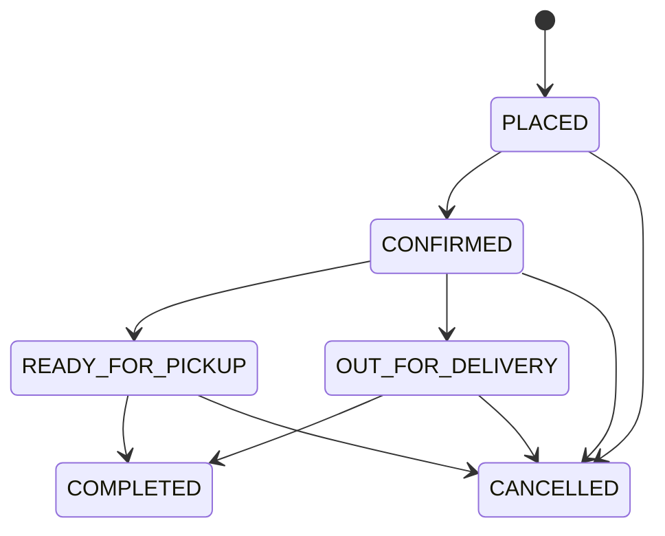

<!-- GENERATED by tools/gen-docs.mjs from shared/constants/enums.ts — DO NOT EDIT BY HAND. Change the source, run `npm run docs:build`. -->

# Enums & Constants Reference

Source of truth: [shared/constants/enums.ts](../../shared/constants/enums.ts) (values), [rules.ts](../../shared/constants/rules.ts) (invariants, state machines, role routes), [errors.ts](../../shared/constants/errors.ts). **Never redeclare these.** Stored enums are mirrored as Postgres enum types (checked by `npm run check`).

| Constant | Stored in DB? | Values |
|---|---|---|
| `APPLICATION_STATUS` | `application_status` | `PENDING`, `APPROVED`, `REJECTED` |
| `BOOKING_STATUS` | `booking_status` | `CONFIRMED`, `CANCELLED`, `COMPLETED` |
| `BOOKING_TYPE` | `booking_type` | `REGULAR`, `MAINTENANCE`, `TRIAL` |
| `ENQUIRY_TYPE` | `enquiry_type` | `GENERAL`, `TRIAL`, `MEMBERSHIP`, `BUSINESS` |
| `EVENT_KIND` | `event_kind` | `TOURNAMENT`, `CLINIC`, `CAMP`, `MIXER`, `SOCIAL` |
| `EXPORT_REPORT` | API only | `REVENUE`, `MEMBERS`, `BOOKINGS`, `SHOP_SALES`, `BAR_SALES`, `TAX` |
| `HISTORY_EVENT_TYPE` | API only | `MEMBERSHIP`, `COURT_BOOKING`, `SHOP_ORDER`, `BAR_ORDER`, `PAYMENT` |
| `INVOICE_PAYMENT_STATE` | `invoice_payment_state` | `UNPAID`, `PARTIALLY_PAID`, `PAID`, `OVERDUE` |
| `INVOICE_STATUS` | `invoice_status` | `DRAFT`, `SENT`, `VOID` |
| `INVOICE_TYPE` | `invoice_type` | `BUSINESS`, `MEMBERSHIP` |
| `LEAVE_DECISION` | API only | `APPROVE`, `REJECT` |
| `LEAVE_STATUS` | `leave_status` | `PENDING`, `APPROVED`, `REJECTED`, `CANCELLED` |
| `MEMBERSHIP_STATUS` | `membership_status` | `UPCOMING`, `ACTIVE`, `EXPIRED`, `CANCELLED` |
| `MEMBERSHIP_TYPE` | `membership_type` | `GOLD`, `SILVER`, `JUNIOR` |
| `MENU_CATEGORY` | `menu_category` | `FOOD`, `SNACK`, `DRINK` |
| `ORDER_FULFILLMENT` | `order_fulfillment` | `PICKUP`, `DELIVERY`, `IN_STORE` |
| `ORDER_STATUS` | `order_status` | `NEW`, `PREPARING`, `READY`, `SERVED`, `CANCELLED` |
| `PAYMENT_METHOD` | `payment_method` | `CASH`, `CARD`, `UPI`, `ONLINE` |
| `PAYMENT_SOURCE_TYPE` | `payment_source_type` | `COURT_BOOKING`, `MEMBERSHIP`, `SHOP_ORDER`, `BAR_ORDER`, `INVOICE` |
| `PAYMENT_STATUS` | `payment_status` | `PENDING`, `PARTIALLY_PAID`, `PAID`, `REFUNDED`, `NOT_REQUIRED` |
| `PAYMENT_TXN_STATUS` | `payment_txn_status` | `SUCCEEDED`, `PARTIALLY_REFUNDED`, `REFUNDED` |
| `PRODUCT_CATEGORY` | `product_category` | `RACKET`, `BALL`, `SHOES`, `ACCESSORY`, `APPAREL` |
| `REPORT_GROUP_BY` | API only | `DAY`, `CATEGORY`, `METHOD` |
| `REPORT_PERIOD` | API only | `TODAY`, `WEEK`, `MONTH` |
| `REVENUE_CATEGORY` | `revenue_category` | `COURT`, `MEMBERSHIP`, `SHOP`, `BAR`, `BUSINESS` |
| `SHIFT_AREA` | `shift_area` | `FRONT_DESK`, `BAR`, `KITCHEN`, `SHOP`, `COURTS` |
| `SHOP_ORDER_STATUS` | `shop_order_status` | `PLACED`, `CONFIRMED`, `READY_FOR_PICKUP`, `OUT_FOR_DELIVERY`, `COMPLETED`, `CANCELLED` |
| `SLOT_STATUS` | API only | `AVAILABLE`, `BOOKED`, `BLOCKED`, `PAST` |
| `SPORT_TYPE` | `sport_type` | `TENNIS`, `CRICKET`, `PADEL`, `BADMINTON` |
| `STOCK_STATUS` | API only | `IN_STOCK`, `LOW_STOCK`, `OUT_OF_STOCK` |
| `USER_ROLE` | `user_role` | `MEMBER`, `FRONT_DESK`, `KITCHEN_MANAGER`, `STORE_MANAGER`, `OWNER_ADMIN` |

## State machines

Defined in `rules.ts` (`*_TRANSITIONS`). The server rejects any other move with `409 INVALID_STATUS_TRANSITION` (`details: { from, to, allowed }`).

**INVOICE_TRANSITIONS**

**LEAVE_TRANSITIONS**

**ORDER_TRANSITIONS**

**SHOP_ORDER_TRANSITIONS**

