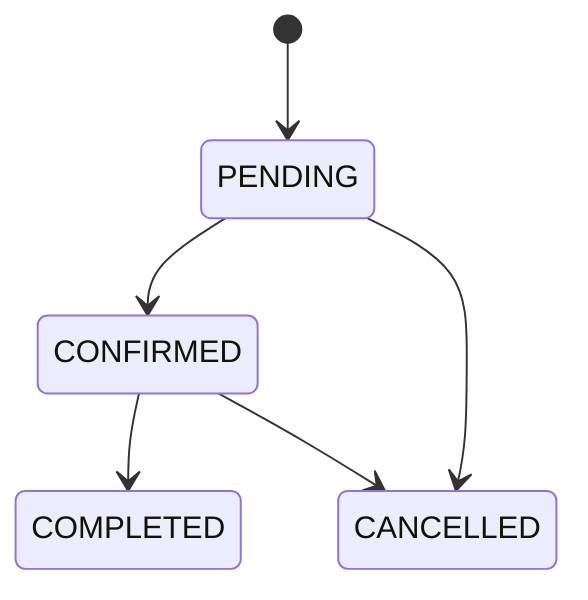
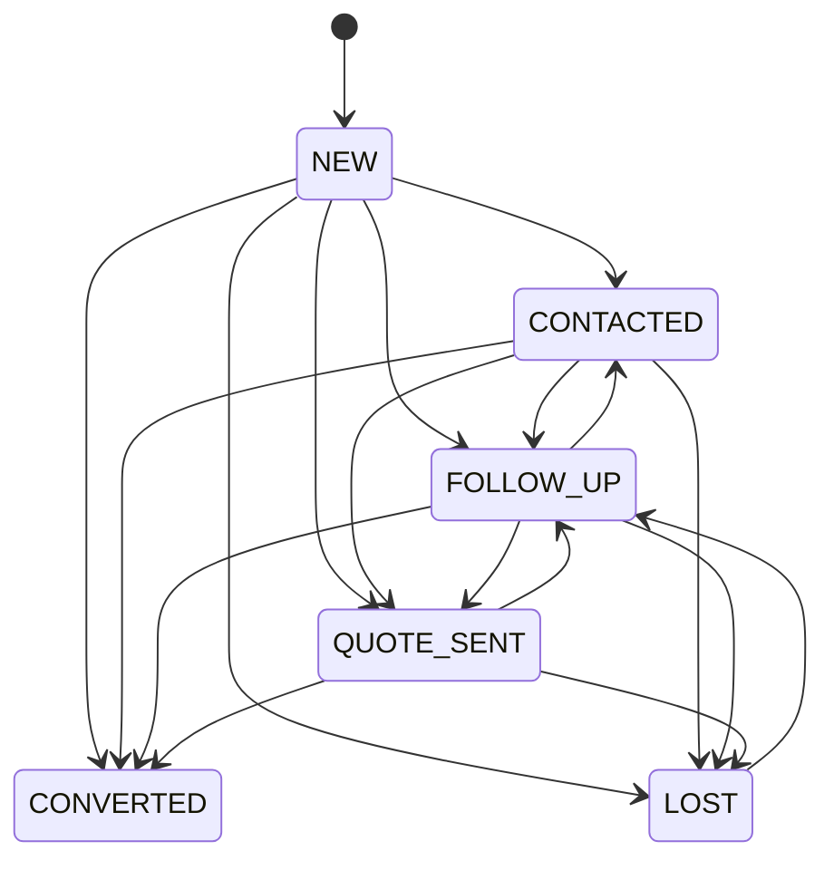
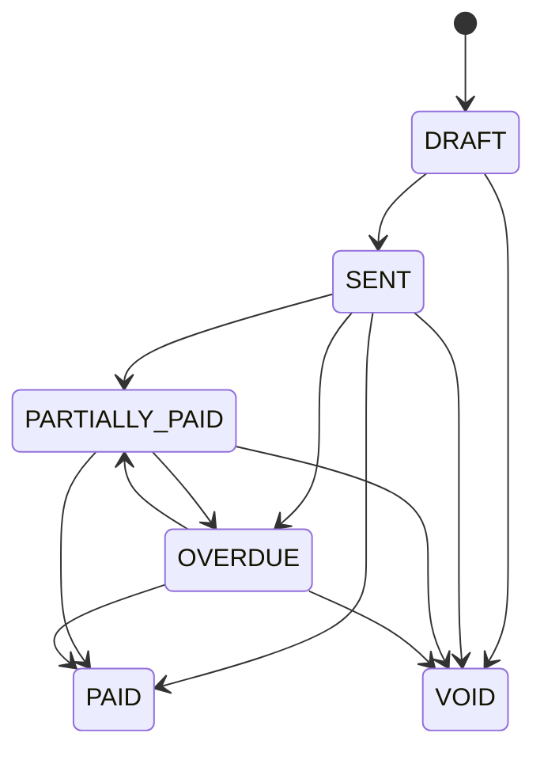
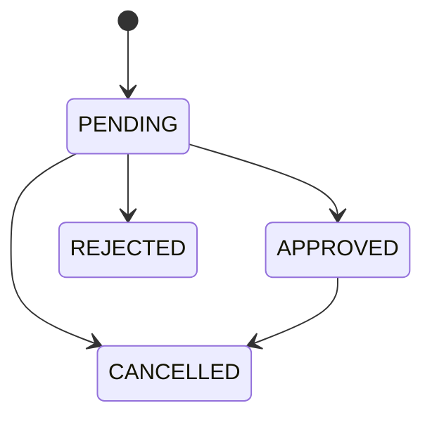
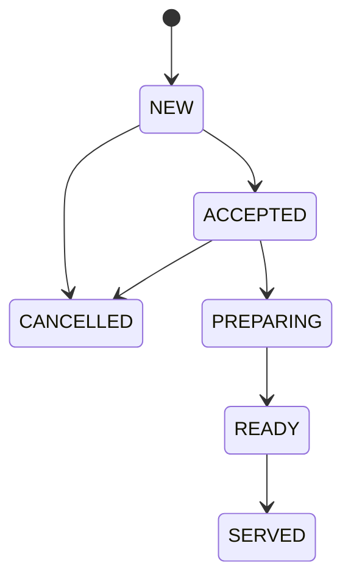
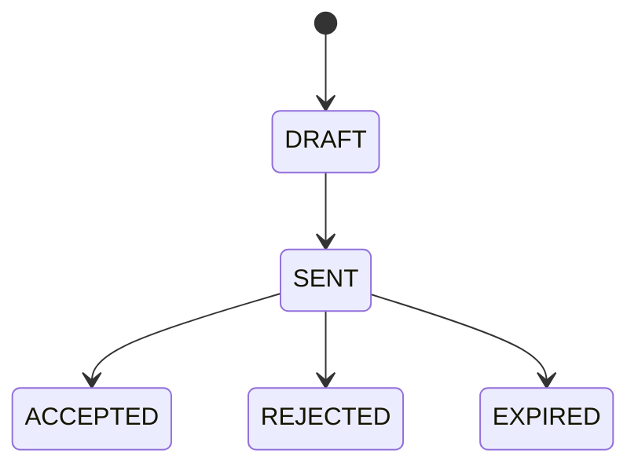
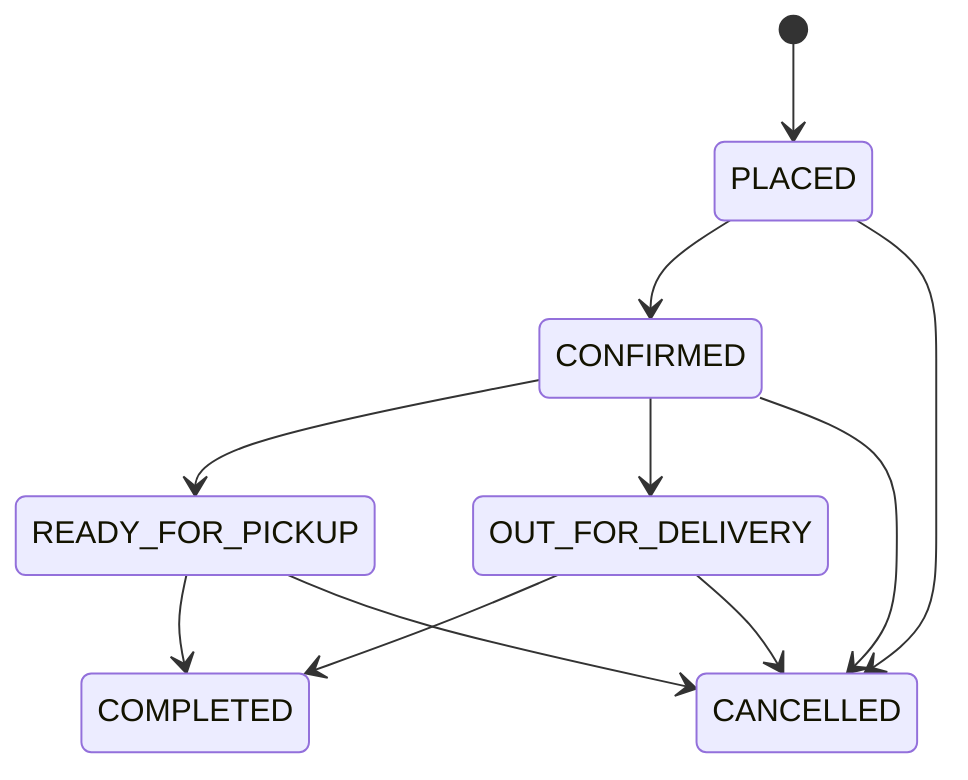
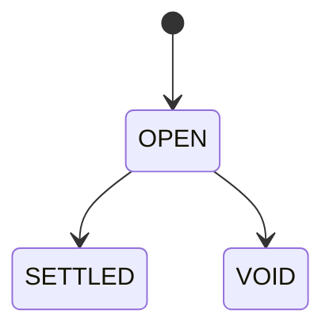

<!-- GENERATED by tools/gen-docs.mjs from shared/constants/enums.ts — DO NOT EDIT BY HAND. Change the source, run `npm run docs:build`. -->

# Enums & Constants Reference

Source of truth: [shared/constants/enums.ts](../../shared/constants/enums.ts) (values), [rules.ts](../../shared/constants/rules.ts) (invariants, state machines, role routes), [errors.ts](../../shared/constants/errors.ts). **Never redeclare these.** Stored enums are mirrored as Postgres enum types (checked by `npm run check`).

| Constant | Stored in DB? | Values |
|---|---|---|
| `BOOKING_STATUS` | `booking_status` | `PENDING`, `CONFIRMED`, `CANCELLED`, `COMPLETED` |
| `BOOKING_TYPE` | `booking_type` | `REGULAR`, `SOCIAL_SESSION`, `TRIAL`, `MAINTENANCE` |
| `CUSTOMER_TYPE` | `customer_type` | `MEMBER`, `WALK_IN` |
| `ENQUIRY_SOURCE` | `enquiry_source` | `WEBSITE`, `PHONE`, `WALK_IN` |
| `ENQUIRY_STATUS` | `enquiry_status` | `NEW`, `CONTACTED`, `QUOTE_SENT`, `FOLLOW_UP`, `CONVERTED`, `LOST` |
| `ENQUIRY_TYPE` | `enquiry_type` | `GENERAL`, `TRIAL`, `MEMBERSHIP`, `BUSINESS` |
| `EXPORT_REPORT` | API only | `REVENUE`, `MEMBERS`, `BOOKINGS`, `SHOP_SALES`, `BAR_SALES`, `TAX` |
| `FOLLOW_UP_METHOD` | `follow_up_method` | `CALL`, `WHATSAPP`, `EMAIL`, `IN_PERSON` |
| `HISTORY_EVENT_TYPE` | API only | `MEMBERSHIP`, `COURT_BOOKING`, `SOCIAL_SESSION`, `SHOP_ORDER`, `BAR_ORDER`, `PAYMENT` |
| `INVENTORY_REASON` | `inventory_reason` | `OPENING`, `RESTOCK`, `SALE`, `RETURN`, `ADJUSTMENT`, `DAMAGE`, `CANCELLATION` |
| `INVOICE_STATUS` | `invoice_status` | `DRAFT`, `SENT`, `PARTIALLY_PAID`, `PAID`, `OVERDUE`, `VOID` |
| `INVOICE_TYPE` | `invoice_type` | `BUSINESS`, `MEMBERSHIP` |
| `LEAVE_DECISION` | API only | `APPROVE`, `REJECT` |
| `LEAVE_STATUS` | `leave_status` | `PENDING`, `APPROVED`, `REJECTED`, `CANCELLED` |
| `LEAVE_TYPE` | `leave_type` | `CASUAL`, `SICK`, `PAID`, `UNPAID` |
| `MEMBERSHIP_STATUS` | `membership_status` | `UPCOMING`, `ACTIVE`, `EXPIRED`, `CANCELLED`, `CHANGED` |
| `MEMBERSHIP_TYPE` | `membership_type` | `GOLD`, `SILVER`, `JUNIOR` |
| `MENU_CATEGORY` | `menu_category` | `FOOD`, `SNACK`, `DRINK` |
| `NOTIFICATION_TYPE` | `notification_type` | `MEMBERSHIP_EXPIRING`, `MEMBERSHIP_EXPIRED`, `BOOKING_CONFIRMED`, `BOOKING_CANCELLED`, `SOCIAL_SESSION_JOINED`, `LOW_STOCK`, `SHOP_ORDER_UPDATE`, `ORDER_READY`, `NEW_ENQUIRY`, `INVOICE_ISSUED`, `PAYMENT_RECEIVED`, `LEAVE_REQUESTED`, `LEAVE_DECIDED`, `SHIFT_ASSIGNED`, `SYSTEM` |
| `ORDER_CHANNEL` | `order_channel` | `PHYSICAL`, `ONLINE` |
| `ORDER_FULFILLMENT` | `order_fulfillment` | `PICKUP`, `DELIVERY`, `IN_STORE` |
| `ORDER_STATUS` | `order_status` | `NEW`, `ACCEPTED`, `PREPARING`, `READY`, `SERVED`, `CANCELLED` |
| `PARTICIPANT_STATUS` | `participant_status` | `JOINED`, `CANCELLED` |
| `PAYMENT_METHOD` | `payment_method` | `CASH`, `CARD`, `UPI`, `ONLINE` |
| `PAYMENT_SOURCE_TYPE` | `payment_source_type` | `COURT_BOOKING`, `SOCIAL_PARTICIPANT`, `MEMBERSHIP`, `SHOP_ORDER`, `BAR_ORDER`, `TAB`, `INVOICE` |
| `PAYMENT_STATUS` | `payment_status` | `PENDING`, `PARTIALLY_PAID`, `PAID`, `REFUNDED`, `FAILED`, `NOT_REQUIRED` |
| `PAYMENT_TXN_STATUS` | `payment_txn_status` | `SUCCEEDED`, `FAILED`, `PARTIALLY_REFUNDED`, `REFUNDED` |
| `PAYROLL_STATUS` | `payroll_status` | `PENDING`, `PAID` |
| `PRODUCT_CATEGORY` | `product_category` | `RACKET`, `BALL`, `SHOES`, `ACCESSORY`, `APPAREL` |
| `QUOTE_STATUS` | `quote_status` | `DRAFT`, `SENT`, `ACCEPTED`, `REJECTED`, `EXPIRED` |
| `REPORT_GROUP_BY` | API only | `DAY`, `CATEGORY`, `METHOD` |
| `REPORT_PERIOD` | API only | `TODAY`, `WEEK`, `MONTH` |
| `REVENUE_CATEGORY` | `revenue_category` | `COURT`, `MEMBERSHIP`, `SHOP`, `BAR`, `BUSINESS` |
| `SHIFT_AREA` | `shift_area` | `FRONT_DESK`, `BAR`, `KITCHEN`, `SHOP`, `COURTS` |
| `SHOP_ORDER_STATUS` | `shop_order_status` | `PLACED`, `CONFIRMED`, `READY_FOR_PICKUP`, `OUT_FOR_DELIVERY`, `COMPLETED`, `CANCELLED` |
| `SLOT_STATUS` | API only | `AVAILABLE`, `BOOKED`, `SOCIAL`, `BLOCKED`, `PAST` |
| `SOCIAL_SESSION_STATUS` | `social_session_status` | `OPEN`, `CANCELLED`, `COMPLETED` |
| `SPORT_TYPE` | `sport_type` | `TENNIS`, `CRICKET`, `PADEL`, `BADMINTON` |
| `STOCK_STATUS` | API only | `IN_STOCK`, `LOW_STOCK`, `OUT_OF_STOCK` |
| `TABLE_STATUS` | `table_status` | `AVAILABLE`, `OCCUPIED`, `OUT_OF_SERVICE` |
| `TAB_STATUS` | `tab_status` | `OPEN`, `SETTLED`, `VOID` |
| `USER_ROLE` | `user_role` | `MEMBER`, `FRONT_DESK`, `KITCHEN_MANAGER`, `BUSINESS_CLIENT`, `OWNER_ADMIN` |

## State machines

Defined in `rules.ts` (`*_TRANSITIONS`). The server rejects any other move with `409 INVALID_STATUS_TRANSITION` (`details: { from, to, allowed }`).

**BOOKING_TRANSITIONS**

**ENQUIRY_TRANSITIONS**

**INVOICE_TRANSITIONS**

**LEAVE_TRANSITIONS**

**ORDER_TRANSITIONS**

**QUOTE_TRANSITIONS**

**SHOP_ORDER_TRANSITIONS**

**TAB_TRANSITIONS**

