<!-- GENERATED by tools/gen-docs.mjs from database/migrations/*.sql, tools/api/ownership.mjs — DO NOT EDIT BY HAND. Change the source, run `npm run docs:build`. -->

# Database Schema — The Champions Club

**ONE canonical PostgreSQL schema.** The migration files in [`database/migrations`](../../database/migrations) are the only definition; local PostgreSQL and Supabase PostgreSQL both run those exact files (see [database/README.md](../../database/README.md)). This page is generated from them. A flat snapshot is in [schema.sql](schema.sql) and the diagram in [er-diagram.mmd](er-diagram.mmd).

## Conventions (mandatory)

| Topic | Rule |
|---|---|
| **Tables** | `snake_case`, **plural**: `members`, `court_bookings`, `shop_orders`. |
| **Columns** | `snake_case`: `member_id`, `membership_plan_id`, `created_at`. Never camelCase / PascalCase. |
| **Primary key** | Always `id uuid PRIMARY KEY DEFAULT gen_random_uuid()`. |
| **Foreign key** | `<singular_entity>_id` → `<entities>.id` (e.g. `court_id` → `courts.id`). Role-specific FKs keep the entity name with a prefix: `created_by_user_id`, `assigned_to_user_id`, `previous_membership_id`. |
| **Enums** | Postgres enum types named `snake_case` singular (`booking_status`), labels `UPPER_SNAKE_CASE`, identical to [enums.ts](../../shared/constants/enums.ts). |
| **Booleans** | `is_*` (`is_active`, `is_public`, `is_available`) or `must_*` (`must_change_password`). |
| **Timestamps** | `timestamptz` in UTC. `created_at` / `updated_at` on every mutable table (trigger maintains `updated_at`); event times are `<verb>_at` (`cancelled_at`, `paid_at`). |
| **Dates / times** | `date` = IST business date; `time` = IST time of day (shifts only). |
| **Money** | `numeric(12,2)` INR, never float. Names: `price`, `unit_price`, `subtotal`, `*_amount`, `*_fee`, `*_rate_per_hour`, `monthly_salary`. Percentages: `numeric(5,2)` named `*_percent` / `tax_rate`. |
| **Human numbers** | `member_code`, `booking_number`, `order_number`, `payment_number`, `invoice_number` come from DB sequences via column defaults. Display only; never FK targets. |
| **Soft delete** | No generic `deleted_at` (R-DATA-02). Catalogue rows use `is_active` / `is_available`; financial and operational rows are never deleted (cancel/void/refund states instead). |
| **Audit fields** | Almost none (ADR-016): `payments.received_by_user_id` records who took the money. Who created or changed other rows is not stored; `payments` is append-only by convention (refunds update the same row, nothing is deleted). |
| **Snapshots** | Prices, item names and the membership used for a discount are COPIED onto bookings/orders at transaction time so later edits never rewrite history. |
| **Security** | RLS enabled on every table with no policies (migration 0002): only the backend, connecting with `DATABASE_URL`, can access data. |

## Design decisions that matter

- **Users vs roles vs memberships.** `users.role` (5 values) decides what you can *do*. Gold/Silver/Junior is *data*: `memberships → membership_plans.membership_type`. A member without a current membership simply pays walk-in rates.
- **Membership history is the `memberships` table.** Purchase, renewal and plan change each add a row. No separate history table.
- **Membership status is derived, never stored.** A term is `member + plan + start_date + end_date`; ACTIVE / EXPIRED (and UPCOMING / CANCELLED) are computed from the dates and `cancelled_at` by the views `membership_terms` and `member_membership_status`. An exclusion constraint stops two live terms of one member from overlapping.
- **One fact, one place (ADR-015, ADR-016).** Anything that follows from other data is computed by a SQL view and never stored: membership status, a booking's status, the amount due / total / payment status of bookings, shop orders, cafe orders and invoices, and a payment's revenue category. Values that record a moment stay stored as snapshots: `list_price`, `discount_amount`, `unit_price`, `price_paid`, `payments.amount` and `tax_amount`.
- **Court occupancy has exactly one home: `court_bookings`.** Regular bookings (member or walk-in guest) and maintenance blocks are rows there; `cancelled_at IS NULL` means the booking stands, so one exclusion constraint guarantees *no two standing bookings overlap on a court* (ADR-006).
- **One shelf.** `products.stock_quantity` is the only stock (no separate ledger); counter and online orders decrement the same row atomically, and `CHECK (stock_quantity >= 0)` makes overselling impossible (ADR-007).
- **Kitchen queue = `bar_orders`.** No second table; the kitchen reads a projection. `table_label` says where an order is served: there are no tab or table records.
- **`payments` is the revenue ledger.** Every rupee received is a row (`source_type` + `source_id`, `method`, `tax_amount`); refunds update the same row, and the revenue category is derived by the view `payment_ledger`. All finance reports sum this table (ADR-009).
- **Tax.** Court, membership, shop and bar prices are **tax-inclusive**; `tax_amount` is the GST portion. **Invoices are tax-exclusive** (B2B). Rates live in `club_settings`.
- **Settings vs constants.** Owner-editable policy → `club_settings`; structural invariants (30-min step, 1-hour session, IST) → `shared/constants/rules.ts`.

## Views (derived data, read-only)

| View | Purpose |
|---|---|
| `membership_terms` | memberships + derived status (UPCOMING/ACTIVE/EXPIRED/CANCELLED) computed from the dates and cancelled_at, never stored (R-MEM-04). |
| `member_membership_status` | One row per member: current or latest plan type and membership_status ACTIVE/EXPIRED (NULL = never had a plan). |
| `court_booking_totals` | Per court booking: derived status, amount_due = list_price - discount_amount, amount_paid (net of refunds) and payment_status. |
| `shop_order_totals` | Per shop order: subtotal from its lines, total_amount = subtotal - discount + delivery fee, amount_paid and payment_status. |
| `bar_order_totals` | Per cafe order: subtotal from its lines, total_amount = subtotal - discount, amount_paid and payment_status. |
| `invoice_totals` | Per invoice: subtotal and tax from its lines and tax_rate, total_amount, amount_paid and the derived payment_state (NULL unless SENT). |
| `payment_ledger` | Per payment: revenue_category (from what it pays for) and status SUCCEEDED/PARTIALLY_REFUNDED/REFUNDED (from refunded_amount). |

Views are created with `security_invoker` and grant nothing to Supabase `anon` / `authenticated` (same RLS posture as migration 0002).

## Entity-relationship diagram

```mermaid
erDiagram
  users ||--o{ members : "user_id"
  users ||--o{ staff : "user_id"
  members ||--o{ memberships : "member_id"
  membership_plans ||--o{ memberships : "membership_plan_id"
  membership_plans ||--o{ enquiries : "membership_plan_id"
  court_bookings ||--o{ enquiries : "trial_booking_id"
  courts ||--o{ court_bookings : "court_id"
  members ||--o{ court_bookings : "member_id"
  members ||--o{ shop_orders : "member_id"
  shop_orders ||--o{ shop_order_items : "shop_order_id"
  products ||--o{ shop_order_items : "product_id"
  members ||--o{ bar_orders : "member_id"
  bar_orders ||--o{ bar_order_items : "bar_order_id"
  bar_menu_items ||--o{ bar_order_items : "bar_menu_item_id"
  members ||--o{ payments : "member_id"
  business_clients ||--o{ payments : "business_client_id"
  users ||--o{ payments : "received_by_user_id"
  business_clients ||--o{ invoices : "business_client_id"
  members ||--o{ invoices : "member_id"
  invoices ||--o{ invoice_items : "invoice_id"
  staff ||--o{ staff_shifts : "staff_id"
  staff ||--o{ leave_requests : "staff_id"
  staff ||--o{ payroll_payments : "staff_id"
  users ||--o{ employee_applications : "reviewed_by_user_id"
  events ||--o{ event_registrations : "event_id"
  members ||--o{ event_registrations : "member_id"
  users {
    uuid id PK
    text email
    user_role role
    text full_name
  }
  members {
    uuid id PK
    uuid user_id FK
  }
  staff {
    uuid id PK
    uuid user_id FK
  }
  business_clients {
    uuid id PK
    text email
  }
  membership_plans {
    uuid id PK
    membership_type membership_type
    text name
    numeric price
  }
  memberships {
    uuid id PK
    uuid member_id FK
    uuid membership_plan_id FK
  }
  enquiries {
    uuid id PK
    enquiry_type enquiry_type
    text name
    text email
    uuid membership_plan_id FK
    sport_type sport_type
    uuid trial_booking_id FK
  }
  courts {
    uuid id PK
    text name
    sport_type sport_type
  }
  court_bookings {
    uuid id PK
    uuid court_id FK
    booking_type booking_type
    uuid member_id FK
    timestamptz start_at
    timestamptz end_at
  }
  products {
    uuid id PK
    text name
    numeric price
  }
  shop_orders {
    uuid id PK
    shop_order_status status
    uuid member_id FK
  }
  shop_order_items {
    uuid id PK
    uuid shop_order_id FK
    uuid product_id FK
  }
  bar_menu_items {
    uuid id PK
    text name
    numeric price
  }
  bar_orders {
    uuid id PK
    uuid member_id FK
    order_status status
  }
  bar_order_items {
    uuid id PK
    uuid bar_order_id FK
    uuid bar_menu_item_id FK
  }
  payments {
    uuid id PK
    payment_source_type source_type
    uuid member_id FK
    uuid business_client_id FK
    numeric amount
    uuid received_by_user_id FK
  }
  invoices {
    uuid id PK
    uuid business_client_id FK
    uuid member_id FK
    invoice_status status
  }
  invoice_items {
    uuid id PK
    uuid invoice_id FK
  }
  staff_shifts {
    uuid id PK
    uuid staff_id FK
  }
  leave_requests {
    uuid id PK
    uuid staff_id FK
    leave_status status
  }
  payroll_payments {
    uuid id PK
    uuid staff_id FK
    numeric amount
  }
  club_settings {
    uuid id PK
  }
  employee_applications {
    uuid id PK
    text full_name
    text email
    application_status status
    uuid reviewed_by_user_id FK
  }
  events {
    uuid id PK
    timestamptz start_at
    timestamptz end_at
  }
  event_registrations {
    uuid id PK
    uuid event_id FK
    uuid member_id FK
  }
```

## Enumerations (24)

| Postgres type | Values | TypeScript |
|---|---|---|
| `membership_type` | `GOLD`, `SILVER`, `JUNIOR` | `MEMBERSHIP_TYPE` |
| `sport_type` | `TENNIS`, `CRICKET`, `PADEL`, `BADMINTON` | `SPORT_TYPE` |
| `product_category` | `RACKET`, `BALL`, `SHOES`, `ACCESSORY`, `APPAREL` | `PRODUCT_CATEGORY` |
| `menu_category` | `FOOD`, `SNACK`, `DRINK` | `MENU_CATEGORY` |
| `order_fulfillment` | `PICKUP`, `DELIVERY`, `IN_STORE` | `ORDER_FULFILLMENT` |
| `shop_order_status` | `PLACED`, `CONFIRMED`, `READY_FOR_PICKUP`, `OUT_FOR_DELIVERY`, `COMPLETED`, `CANCELLED` | `SHOP_ORDER_STATUS` |
| `payment_method` | `CASH`, `CARD`, `UPI`, `ONLINE` | `PAYMENT_METHOD` |
| `revenue_category` | `COURT`, `MEMBERSHIP`, `SHOP`, `BAR`, `BUSINESS` | `REVENUE_CATEGORY` |
| `invoice_type` | `BUSINESS`, `MEMBERSHIP` | `INVOICE_TYPE` |
| `enquiry_type` | `GENERAL`, `TRIAL`, `MEMBERSHIP`, `BUSINESS` | `ENQUIRY_TYPE` |
| `shift_area` | `FRONT_DESK`, `BAR`, `KITCHEN`, `SHOP`, `COURTS` | `SHIFT_AREA` |
| `leave_status` | `PENDING`, `APPROVED`, `REJECTED`, `CANCELLED` | `LEAVE_STATUS` |
| `booking_type` | `REGULAR`, `MAINTENANCE`, `TRIAL` | `BOOKING_TYPE` |
| `order_status` | `NEW`, `PREPARING`, `READY`, `SERVED`, `CANCELLED` | `ORDER_STATUS` |
| `payment_source_type` | `COURT_BOOKING`, `MEMBERSHIP`, `SHOP_ORDER`, `BAR_ORDER`, `INVOICE` | `PAYMENT_SOURCE_TYPE` |
| `invoice_status` | `DRAFT`, `SENT`, `VOID` | `INVOICE_STATUS` |
| `membership_status` | `UPCOMING`, `ACTIVE`, `EXPIRED`, `CANCELLED` | `MEMBERSHIP_STATUS` |
| `booking_status` | `CONFIRMED`, `CANCELLED`, `COMPLETED` | `BOOKING_STATUS` |
| `payment_status` | `PENDING`, `PARTIALLY_PAID`, `PAID`, `REFUNDED`, `NOT_REQUIRED` | `PAYMENT_STATUS` |
| `payment_txn_status` | `SUCCEEDED`, `PARTIALLY_REFUNDED`, `REFUNDED` | `PAYMENT_TXN_STATUS` |
| `invoice_payment_state` | `UNPAID`, `PARTIALLY_PAID`, `PAID`, `OVERDUE` | `INVOICE_PAYMENT_STATE` |
| `user_role` | `MEMBER`, `FRONT_DESK`, `KITCHEN_MANAGER`, `STORE_MANAGER`, `OWNER_ADMIN` | `USER_ROLE` |
| `application_status` | `PENDING`, `APPROVED`, `REJECTED` | `APPLICATION_STATUS` |
| `event_kind` | `TOURNAMENT`, `CLINIC`, `CAMP`, `MIXER`, `SOCIAL` | `EVENT_KIND` |

## Tables (25)

| Table | Owner | Purpose |
|---|---|---|
| [`users`](#users) | Dev 1 | Login identity + role for every person (member, front desk, kitchen, store manager, owner). One table, one auth path; account on/off lives here (is_active). |
| [`members`](#members) | Dev 2 | Club profile of a user with role MEMBER (member code, date of birth, emergency contact). Gold/Silver/Junior is NOT stored here: see memberships. |
| [`staff`](#staff) | Dev 4 | Employee record (designation, salary, hire date) for FRONT_DESK / KITCHEN_MANAGER / STORE_MANAGER / OWNER_ADMIN users. |
| [`business_clients`](#business_clients) | Dev 4 | Companies invoiced by the club (no login). |
| [`membership_plans`](#membership_plans) | Dev 2 | Gold / Silver / Junior definitions: price, discounts, plays per day, max age, benefits (all behaviour is data-driven). |
| [`memberships`](#memberships) | Dev 2 | One row per membership TERM: member + plan + start/end date + price paid. ACTIVE / EXPIRED is derived from the dates (views membership_terms, member_membership_status), never stored. |
| [`enquiries`](#enquiries) | Dev 1 | Contact and trial requests from the website or the desk: a plain inbox (handled_at NULL = still waiting). |
| [`courts`](#courts) | Dev 2 | Courts / nets with sport, surface and walk-in hourly rate. |
| [`court_bookings`](#court_bookings) | Dev 2 | The ONLY table holding court occupancy (regular bookings and maintenance blocks). cancelled_at NULL = the booking stands; the exclusion constraint prevents overlaps. Amounts and status are derived (view court_booking_totals). |
| [`products`](#products) | Dev 3 | Shop catalogue AND current stock (stock_quantity): one shelf for counter and online. |
| [`shop_orders`](#shop_orders) | Dev 3 | Counter (IN_STORE) and online (PICKUP / DELIVERY) shop orders. Totals and payment status are derived (view shop_order_totals). |
| [`shop_order_items`](#shop_order_items) | Dev 3 | Shop order lines with price snapshots. |
| [`bar_menu_items`](#bar_menu_items) | Dev 3 | Cafe menu. |
| [`bar_orders`](#bar_orders) | Dev 3 | Cafe orders; also the kitchen queue (status NEW -> SERVED). table_label says where it is served; there are no tabs or table records. Totals and payment status are derived (view bar_order_totals). |
| [`bar_order_items`](#bar_order_items) | Dev 3 | Cafe order lines with price snapshots. |
| [`payments`](#payments) | Dev 4 | Revenue ledger: every rupee received (and refunded). Revenue category and refund status are derived (view payment_ledger). All finance reports aggregate this table. |
| [`invoices`](#invoices) | Dev 4 | Tax-exclusive invoices for business clients (and membership invoices to a member): lifecycle DRAFT / SENT / VOID. Totals and the paid / overdue state are derived (view invoice_totals). |
| [`invoice_items`](#invoice_items) | Dev 4 | Invoice lines. |
| [`staff_shifts`](#staff_shifts) | Dev 4 | Shift roster (same-day shifts). |
| [`leave_requests`](#leave_requests) | Dev 4 | Staff leave with approval workflow. |
| [`payroll_payments`](#payroll_payments) | Dev 4 | Monthly salary payments to employees (paid_on NULL = pending). |
| [`club_settings`](#club_settings) | Dev 4 | Owner-editable policy values (hours, tax rates, delivery fee, cut-offs). |
| [`employee_applications`](#employee_applications) | Dev 4 | Job applications: PENDING until the owner approves (creating users + staff) or rejects. Not an employee. The applicant bcrypt hash exists only while PENDING. |
| [`events`](#events) | Dev 4 | Club events (tournament, clinic, camp, mixer, social) the owner creates; every role reads the same rows. |
| [`event_registrations`](#event_registrations) | Dev 4 | Which member registered for which event (one row per member and event; capacity is enforced from the count). |

### users

Login identity + role for every person (member, front desk, kitchen, store manager, owner). One table, one auth path; account on/off lives here (is_active).  
*Owner: Dev 1*

| Column | Type | Null | Default | References | Notes |
|---|---|---|---|---|---|
| `id` | uuid |  | yes |  | PK |
| `email` | text |  |  |  |  |
| `password_hash` | text |  |  |  |  |
| `role` | user_role |  |  |  |  |
| `full_name` | text |  |  |  |  |
| `phone` | text | yes |  |  |  |
| `is_active` | boolean |  | yes |  |  |
| `must_change_password` | boolean |  | yes |  |  |
| `created_at` | timestamptz |  | yes |  |  |
| `updated_at` | timestamptz |  | yes |  |  |

**Constraints & indexes**

- UNIQUE INDEX `users_email_key` (lower(email))
- INDEX `users_role_idx` (role)

### members

Club profile of a user with role MEMBER (member code, date of birth, emergency contact). Gold/Silver/Junior is NOT stored here: see memberships.  
*Owner: Dev 2*

| Column | Type | Null | Default | References | Notes |
|---|---|---|---|---|---|
| `id` | uuid |  | yes |  | PK |
| `user_id` | uuid |  |  | `users.id` | unique |
| `member_code` | text |  | yes |  | unique |
| `date_of_birth` | date | yes |  |  |  |
| `address` | text | yes |  |  |  |
| `emergency_contact_name` | text | yes |  |  |  |
| `emergency_contact_phone` | text | yes |  |  |  |
| `photo_url` | text | yes |  |  |  |
| `joined_on` | date |  | yes |  |  |
| `created_at` | timestamptz |  | yes |  |  |
| `updated_at` | timestamptz |  | yes |  |  |

### staff

Employee record (designation, salary, hire date) for FRONT_DESK / KITCHEN_MANAGER / STORE_MANAGER / OWNER_ADMIN users.  
*Owner: Dev 4*

| Column | Type | Null | Default | References | Notes |
|---|---|---|---|---|---|
| `id` | uuid |  | yes |  | PK |
| `user_id` | uuid |  |  | `users.id` | unique |
| `designation` | text |  |  |  |  |
| `monthly_salary` | numeric(12,2) |  | yes |  |  |
| `joined_on` | date |  | yes |  |  |
| `created_at` | timestamptz |  | yes |  |  |
| `updated_at` | timestamptz |  | yes |  |  |

### business_clients

Companies invoiced by the club (no login).  
*Owner: Dev 4*

| Column | Type | Null | Default | References | Notes |
|---|---|---|---|---|---|
| `id` | uuid |  | yes |  | PK |
| `company_name` | text |  |  |  |  |
| `contact_name` | text |  |  |  |  |
| `email` | text |  |  |  |  |
| `phone` | text | yes |  |  |  |
| `gstin` | text | yes |  |  |  |
| `billing_address` | text | yes |  |  |  |
| `notes` | text | yes |  |  |  |
| `is_active` | boolean |  | yes |  |  |
| `created_at` | timestamptz |  | yes |  |  |
| `updated_at` | timestamptz |  | yes |  |  |

### membership_plans

Gold / Silver / Junior definitions: price, discounts, plays per day, max age, benefits (all behaviour is data-driven).  
*Owner: Dev 2*

| Column | Type | Null | Default | References | Notes |
|---|---|---|---|---|---|
| `id` | uuid |  | yes |  | PK |
| `membership_type` | membership_type |  |  |  |  |
| `name` | text |  |  |  |  |
| `description` | text | yes |  |  |  |
| `duration_months` | integer |  |  |  |  |
| `price` | numeric(12,2) |  |  |  |  |
| `court_discount_percent` | numeric(5,2) |  | yes |  | 100 = free courts |
| `shop_discount_percent` | numeric(5,2) |  | yes |  |  |
| `bar_discount_percent` | numeric(5,2) |  | yes |  |  |
| `max_plays_per_day` | integer |  | yes |  |  |
| `max_age` | integer | yes |  |  | Junior: 17 (under 18) |
| `benefits` | text[] |  | yes |  | bullet list shown on the website |
| `sort_order` | integer |  | yes |  |  |
| `is_active` | boolean |  | yes |  |  |
| `created_at` | timestamptz |  | yes |  |  |
| `updated_at` | timestamptz |  | yes |  |  |

**Constraints & indexes**

- `UNIQUE (membership_type, duration_months)`

### memberships

One row per membership TERM: member + plan + start/end date + price paid. ACTIVE / EXPIRED is derived from the dates (views membership_terms, member_membership_status), never stored.  
*Owner: Dev 2*

| Column | Type | Null | Default | References | Notes |
|---|---|---|---|---|---|
| `id` | uuid |  | yes |  | PK |
| `member_id` | uuid |  |  | `members.id` |  |
| `membership_plan_id` | uuid |  |  | `membership_plans.id` |  |
| `start_date` | date |  |  |  |  |
| `end_date` | date |  |  |  | last valid day (inclusive) |
| `price_paid` | numeric(12,2) |  | yes |  | Price at purchase (snapshot, R-MEM-11): a later plan price edit never rewrites it. Price at purchase (snapshot, R-MEM-11): a later plan price edit never rewrites it. |
| `cancelled_at` | timestamptz | yes |  |  | Set when the term ended early: cancelled by the owner (R-MEM-09) or superseded by a plan change (R-MEM-08). end_date is then the last day benefits applied. Set only when the owner cancels a term (R-MEM-09). A replaced or finished term just has an earlier end_date. |
| `cancellation_reason` | text | yes |  |  |  |
| `created_at` | timestamptz |  | yes |  |  |
| `updated_at` | timestamptz |  | yes |  |  |

**Constraints & indexes**

- `CHECK (end_date >= start_date)`
- `CONSTRAINT memberships_no_overlap EXCLUDE USING gist (member_id WITH =, daterange(start_date, end_date, '[]') WITH &&) WHERE (cancelled_at IS NULL)`
- INDEX `memberships_member_idx` (member_id, start_date DESC)
- INDEX `memberships_end_date_idx` (end_date) WHERE cancelled_at IS NULL

### enquiries

Contact and trial requests from the website or the desk: a plain inbox (handled_at NULL = still waiting).  
*Owner: Dev 1*

| Column | Type | Null | Default | References | Notes |
|---|---|---|---|---|---|
| `id` | uuid |  | yes |  | PK |
| `enquiry_type` | enquiry_type |  | yes |  |  |
| `name` | text |  |  |  |  |
| `email` | text | yes |  |  |  |
| `phone` | text |  |  |  |  |
| `message` | text | yes |  |  |  |
| `membership_plan_id` | uuid | yes |  | `membership_plans.id` | plan they asked about |
| `sport_type` | sport_type | yes |  |  | trial: preferred sport |
| `preferred_start_at` | timestamptz | yes |  |  | trial: preferred slot |
| `created_at` | timestamptz |  | yes |  |  |
| `updated_at` | timestamptz |  | yes |  |  |
| `handled_at` | timestamptz | yes |  |  | NULL = new, waiting for the front desk. Set when somebody has dealt with the enquiry. |
| `trial_booking_id` | uuid | yes |  | `court_bookings.id` |  |

**Constraints & indexes**

- INDEX `enquiries_open_idx` (created_at DESC) WHERE handled_at IS NULL

### courts

Courts / nets with sport, surface and walk-in hourly rate.  
*Owner: Dev 2*

| Column | Type | Null | Default | References | Notes |
|---|---|---|---|---|---|
| `id` | uuid |  | yes |  | PK |
| `name` | text |  |  |  | unique |
| `sport_type` | sport_type |  |  |  |  |
| `description` | text | yes |  |  |  |
| `surface` | text | yes |  |  |  |
| `walk_in_rate_per_hour` | numeric(12,2) |  |  |  |  |
| `image_url` | text | yes |  |  |  |
| `sort_order` | integer |  | yes |  |  |
| `is_active` | boolean |  | yes |  |  |
| `created_at` | timestamptz |  | yes |  |  |
| `updated_at` | timestamptz |  | yes |  |  |

### court_bookings

The ONLY table holding court occupancy (regular bookings and maintenance blocks). cancelled_at NULL = the booking stands; the exclusion constraint prevents overlaps. Amounts and status are derived (view court_booking_totals).  
*Owner: Dev 2*

| Column | Type | Null | Default | References | Notes |
|---|---|---|---|---|---|
| `id` | uuid |  | yes |  | PK |
| `booking_number` | text |  | yes |  | unique |
| `court_id` | uuid |  |  | `courts.id` |  |
| `booking_type` | booking_type |  | yes |  |  |
| `member_id` | uuid | yes |  | `members.id` |  |
| `guest_name` | text | yes |  |  |  |
| `guest_phone` | text | yes |  |  |  |
| `start_at` | timestamptz |  |  |  |  |
| `end_at` | timestamptz |  |  |  |  |
| `list_price` | numeric(12,2) |  | yes |  | walk-in price at booking time Walk-in price at booking time (snapshot). amount due = list_price - discount_amount (view court_booking_totals). |
| `discount_amount` | numeric(12,2) |  | yes |  | Member discount granted at booking time (snapshot, R-MEM-11). |
| `cancelled_at` | timestamptz | yes |  |  | NULL = the booking stands. The exclusion constraint only guards bookings that are not cancelled. |
| `created_at` | timestamptz |  | yes |  |  |
| `updated_at` | timestamptz |  | yes |  |  |
| `guest_email` | text | yes |  |  |  |

**Constraints & indexes**

- `CHECK (end_at = start_at + interval '1 hour')`
- `CHECK (date_part('minute', start_at AT TIME ZONE 'UTC') IN (0, 30) AND date_part('second', start_at AT TIME ZONE 'UTC') = 0)`
- `CONSTRAINT court_bookings_no_overlap EXCLUDE USING gist (court_id WITH =, tstzrange(start_at, end_at, '[)') WITH &&) WHERE (cancelled_at IS NULL)`
- `CONSTRAINT court_bookings_customer_known CHECK (member_id IS NOT NULL OR guest_name IS NOT NULL OR booking_type = 'MAINTENANCE')`
- INDEX `court_bookings_member_idx` (member_id, start_at)
- INDEX `court_bookings_day_idx` (court_id, start_at)

### products

Shop catalogue AND current stock (stock_quantity): one shelf for counter and online.  
*Owner: Dev 3*

| Column | Type | Null | Default | References | Notes |
|---|---|---|---|---|---|
| `id` | uuid |  | yes |  | PK |
| `sku` | text |  |  |  | unique |
| `name` | text |  |  |  |  |
| `category` | product_category |  |  |  |  |
| `brand` | text | yes |  |  |  |
| `description` | text | yes |  |  |  |
| `price` | numeric(12,2) |  |  |  | tax inclusive |
| `image_url` | text | yes |  |  |  |
| `stock_quantity` | integer |  | yes |  | DB refuses negative stock |
| `low_stock_threshold` | integer |  | yes |  |  |
| `is_active` | boolean |  | yes |  |  |
| `created_at` | timestamptz |  | yes |  |  |
| `updated_at` | timestamptz |  | yes |  |  |

**Constraints & indexes**

- INDEX `products_category_idx` (category) WHERE is_active

### shop_orders

Counter (IN_STORE) and online (PICKUP / DELIVERY) shop orders. Totals and payment status are derived (view shop_order_totals).  
*Owner: Dev 3*

| Column | Type | Null | Default | References | Notes |
|---|---|---|---|---|---|
| `id` | uuid |  | yes |  | PK |
| `order_number` | text |  | yes |  | unique |
| `fulfillment` | order_fulfillment |  |  |  |  |
| `status` | shop_order_status |  | yes |  |  |
| `member_id` | uuid | yes |  | `members.id` |  |
| `guest_name` | text | yes |  |  |  |
| `guest_phone` | text | yes |  |  |  |
| `delivery_address` | text | yes |  |  |  |
| `discount_amount` | numeric(12,2) |  | yes |  |  |
| `delivery_fee` | numeric(12,2) |  | yes |  |  |
| `created_at` | timestamptz |  | yes |  |  |
| `updated_at` | timestamptz |  | yes |  |  |

**Constraints & indexes**

- `CHECK (fulfillment <> 'DELIVERY' OR delivery_address IS NOT NULL)`
- `CONSTRAINT shop_orders_online_needs_member CHECK (fulfillment = 'IN_STORE' OR member_id IS NOT NULL)`
- `CONSTRAINT shop_orders_customer_known CHECK (member_id IS NOT NULL OR guest_name IS NOT NULL OR fulfillment = 'IN_STORE')`
- INDEX `shop_orders_member_idx` (member_id, created_at DESC)
- INDEX `shop_orders_status_idx` (status, created_at DESC)

### shop_order_items

Shop order lines with price snapshots.  
*Owner: Dev 3*

| Column | Type | Null | Default | References | Notes |
|---|---|---|---|---|---|
| `id` | uuid |  | yes |  | PK |
| `shop_order_id` | uuid |  |  | `shop_orders.id` |  |
| `product_id` | uuid |  |  | `products.id` |  |
| `product_name` | text |  |  |  | snapshot |
| `unit_price` | numeric(12,2) |  |  |  | snapshot |
| `quantity` | integer |  |  |  |  |
| `created_at` | timestamptz |  | yes |  |  |

**Constraints & indexes**

- `UNIQUE (shop_order_id, product_id)`

### bar_menu_items

Cafe menu.  
*Owner: Dev 3*

| Column | Type | Null | Default | References | Notes |
|---|---|---|---|---|---|
| `id` | uuid |  | yes |  | PK |
| `name` | text |  |  |  | unique |
| `category` | menu_category |  |  |  |  |
| `description` | text | yes |  |  |  |
| `price` | numeric(12,2) |  |  |  | tax inclusive |
| `is_available` | boolean |  | yes |  |  |
| `sort_order` | integer |  | yes |  |  |
| `created_at` | timestamptz |  | yes |  |  |
| `updated_at` | timestamptz |  | yes |  |  |
| `stock_quantity` | integer |  | yes |  |  |
| `low_stock_threshold` | integer |  | yes |  |  |

### bar_orders

Cafe orders; also the kitchen queue (status NEW -> SERVED). table_label says where it is served; there are no tabs or table records. Totals and payment status are derived (view bar_order_totals).  
*Owner: Dev 3*

| Column | Type | Null | Default | References | Notes |
|---|---|---|---|---|---|
| `id` | uuid |  | yes |  | PK |
| `order_number` | text |  | yes |  | unique |
| `member_id` | uuid | yes |  | `members.id` |  |
| `guest_name` | text | yes |  |  |  |
| `status` | order_status |  | yes |  |  |
| `discount_amount` | numeric(12,2) |  | yes |  |  |
| `notes` | text | yes |  |  |  |
| `created_at` | timestamptz |  | yes |  |  |
| `updated_at` | timestamptz |  | yes |  |  |
| `table_label` | text | yes |  |  | Free-text table or seat the cafe order is served at (replaces the former bar_tables / bar_tabs). |

**Constraints & indexes**

- `CONSTRAINT bar_orders_customer_known CHECK (member_id IS NOT NULL OR guest_name IS NOT NULL OR table_label IS NOT NULL)`
- INDEX `bar_orders_status_idx` (status, created_at)
- INDEX `bar_orders_day_idx` (created_at)

### bar_order_items

Cafe order lines with price snapshots.  
*Owner: Dev 3*

| Column | Type | Null | Default | References | Notes |
|---|---|---|---|---|---|
| `id` | uuid |  | yes |  | PK |
| `bar_order_id` | uuid |  |  | `bar_orders.id` |  |
| `bar_menu_item_id` | uuid |  |  | `bar_menu_items.id` |  |
| `item_name` | text |  |  |  | snapshot |
| `unit_price` | numeric(12,2) |  |  |  | snapshot |
| `quantity` | integer |  |  |  |  |
| `notes` | text | yes |  |  |  |
| `created_at` | timestamptz |  | yes |  |  |

**Constraints & indexes**

- INDEX `bar_order_items_order_idx` (bar_order_id)

### payments

Revenue ledger: every rupee received (and refunded). Revenue category and refund status are derived (view payment_ledger). All finance reports aggregate this table.  
*Owner: Dev 4*

| Column | Type | Null | Default | References | Notes |
|---|---|---|---|---|---|
| `id` | uuid |  | yes |  | PK |
| `payment_number` | text |  | yes |  | unique |
| `source_type` | payment_source_type |  |  |  | What this payment pays for. Together with source_id a deliberate polymorphic reference (ADR-009), no FK. |
| `source_id` | uuid |  |  |  |  |
| `member_id` | uuid | yes |  | `members.id` |  |
| `business_client_id` | uuid | yes |  | `business_clients.id` |  |
| `payer_name` | text | yes |  |  | guests / walk-ins |
| `amount` | numeric(12,2) |  |  |  | gross received (tax inclusive) |
| `tax_amount` | numeric(12,2) |  | yes |  | GST portion of `amount` GST portion of amount at payment time (snapshot): reports sum this column (R-FIN-07). |
| `method` | payment_method |  |  |  |  |
| `gateway_reference` | text | yes |  |  | UPI ref / card auth / online txn id |
| `received_by_user_id` | uuid | yes |  | `users.id` |  |
| `paid_at` | timestamptz |  | yes |  |  |
| `refunded_amount` | numeric(12,2) |  | yes |  |  |
| `refund_reason` | text | yes |  |  |  |
| `refunded_at` | timestamptz | yes |  |  |  |
| `notes` | text | yes |  |  |  |
| `created_at` | timestamptz |  | yes |  |  |
| `updated_at` | timestamptz |  | yes |  |  |

**Constraints & indexes**

- `CHECK (refunded_amount <= amount)`
- INDEX `payments_paid_at_idx` (paid_at)
- INDEX `payments_source_idx` (source_type, source_id)

### invoices

Tax-exclusive invoices for business clients (and membership invoices to a member): lifecycle DRAFT / SENT / VOID. Totals and the paid / overdue state are derived (view invoice_totals).  
*Owner: Dev 4*

| Column | Type | Null | Default | References | Notes |
|---|---|---|---|---|---|
| `id` | uuid |  | yes |  | PK |
| `invoice_number` | text |  | yes |  | unique |
| `business_client_id` | uuid | yes |  | `business_clients.id` |  |
| `member_id` | uuid | yes |  | `members.id` |  |
| `status` | invoice_status |  | yes |  |  |
| `issue_date` | date |  | yes |  |  |
| `due_date` | date |  |  |  |  |
| `tax_rate` | numeric(5,2) |  | yes |  |  |
| `notes` | text | yes |  |  |  |
| `created_at` | timestamptz |  | yes |  |  |
| `updated_at` | timestamptz |  | yes |  |  |

**Constraints & indexes**

- `CHECK (due_date >= issue_date)`
- `CONSTRAINT invoices_one_recipient CHECK ((business_client_id IS NOT NULL) <> (member_id IS NOT NULL))`
- INDEX `invoices_client_idx` (business_client_id)
- INDEX `invoices_status_idx` (status, due_date)

### invoice_items

Invoice lines.  
*Owner: Dev 4*

| Column | Type | Null | Default | References | Notes |
|---|---|---|---|---|---|
| `id` | uuid |  | yes |  | PK |
| `invoice_id` | uuid |  |  | `invoices.id` |  |
| `description` | text |  |  |  |  |
| `quantity` | integer |  | yes |  |  |
| `unit_price` | numeric(12,2) |  |  |  |  |
| `created_at` | timestamptz |  | yes |  |  |

### staff_shifts

Shift roster (same-day shifts).  
*Owner: Dev 4*

| Column | Type | Null | Default | References | Notes |
|---|---|---|---|---|---|
| `id` | uuid |  | yes |  | PK |
| `staff_id` | uuid |  |  | `staff.id` |  |
| `shift_date` | date |  |  |  |  |
| `start_time` | time |  |  |  |  |
| `end_time` | time |  |  |  | same-day shifts only (end > start) |
| `area` | shift_area |  |  |  |  |
| `created_at` | timestamptz |  | yes |  |  |
| `updated_at` | timestamptz |  | yes |  |  |

**Constraints & indexes**

- `CHECK (end_time > start_time)`
- `UNIQUE (staff_id, shift_date, start_time)`
- INDEX `staff_shifts_date_idx` (shift_date)

### leave_requests

Staff leave with approval workflow.  
*Owner: Dev 4*

| Column | Type | Null | Default | References | Notes |
|---|---|---|---|---|---|
| `id` | uuid |  | yes |  | PK |
| `staff_id` | uuid |  |  | `staff.id` |  |
| `start_date` | date |  |  |  |  |
| `end_date` | date |  |  |  |  |
| `reason` | text | yes |  |  |  |
| `status` | leave_status |  | yes |  |  |
| `decision_note` | text | yes |  |  |  |
| `created_at` | timestamptz |  | yes |  |  |
| `updated_at` | timestamptz |  | yes |  |  |

**Constraints & indexes**

- `CHECK (end_date >= start_date)`
- INDEX `leave_requests_status_idx` (status, start_date)

### payroll_payments

Monthly salary payments to employees (paid_on NULL = pending).  
*Owner: Dev 4*

| Column | Type | Null | Default | References | Notes |
|---|---|---|---|---|---|
| `id` | uuid |  | yes |  | PK |
| `staff_id` | uuid |  |  | `staff.id` |  |
| `pay_period` | date |  |  |  | first day of the month being paid |
| `amount` | numeric(12,2) |  |  |  |  |
| `method` | payment_method |  |  |  |  |
| `paid_on` | date | yes |  |  |  |
| `created_at` | timestamptz |  | yes |  |  |
| `updated_at` | timestamptz |  | yes |  |  |

**Constraints & indexes**

- `CHECK (date_part('day', pay_period) = 1)`
- `UNIQUE (staff_id, pay_period)`

### club_settings

Owner-editable policy values (hours, tax rates, delivery fee, cut-offs).  
*Owner: Dev 4*

| Column | Type | Null | Default | References | Notes |
|---|---|---|---|---|---|
| `id` | uuid |  | yes |  | PK |
| `key` | text |  |  |  | unique |
| `value` | jsonb |  |  |  |  |
| `description` | text | yes |  |  |  |
| `is_public` | boolean |  | yes |  | exposed by GET /public/club |
| `created_at` | timestamptz |  | yes |  |  |
| `updated_at` | timestamptz |  | yes |  |  |

### employee_applications

Job applications: PENDING until the owner approves (creating users + staff) or rejects. Not an employee. The applicant bcrypt hash exists only while PENDING.  
*Owner: Dev 4*

| Column | Type | Null | Default | References | Notes |
|---|---|---|---|---|---|
| `id` | uuid |  | yes |  | PK |
| `full_name` | text |  |  |  |  |
| `email` | text |  |  |  |  |
| `phone` | text | yes |  |  |  |
| `password_hash` | text | yes |  |  | bcrypt; only while PENDING, cleared on a decision |
| `status` | application_status |  | yes |  |  |
| `approved_role` | user_role | yes |  |  | set on APPROVED: FRONT_DESK \| KITCHEN_MANAGER \| STORE_MANAGER |
| `applied_at` | timestamptz |  | yes |  |  |
| `reviewed_at` | timestamptz | yes |  |  |  |
| `reviewed_by_user_id` | uuid | yes |  | `users.id` |  |
| `decision_note` | text | yes |  |  |  |

**Constraints & indexes**

- `CHECK ((status = 'PENDING') = (password_hash IS NOT NULL))`
- `CHECK ((status = 'PENDING') = (reviewed_at IS NULL))`
- `CHECK ((status = 'APPROVED') = (approved_role IS NOT NULL))`
- `CHECK (approved_role IS NULL OR approved_role IN ('FRONT_DESK','KITCHEN_MANAGER','STORE_MANAGER'))`
- UNIQUE INDEX `employee_applications_pending_email_key` (lower(email)) WHERE status = 'PENDING'
- INDEX `employee_applications_status_idx` (status, applied_at DESC)

### events

Club events (tournament, clinic, camp, mixer, social) the owner creates; every role reads the same rows.  
*Owner: Dev 4*

| Column | Type | Null | Default | References | Notes |
|---|---|---|---|---|---|
| `id` | uuid |  | yes |  | PK |
| `title` | text |  |  |  |  |
| `kind` | event_kind |  |  |  |  |
| `description` | text | yes |  |  |  |
| `location` | text |  |  |  |  |
| `start_at` | timestamptz |  |  |  |  |
| `end_at` | timestamptz |  |  |  |  |
| `capacity` | integer |  |  |  |  |
| `fee` | numeric(12,2) |  | yes |  |  |
| `created_at` | timestamptz |  | yes |  |  |
| `updated_at` | timestamptz |  | yes |  |  |

**Constraints & indexes**

- `CHECK (end_at > start_at)`
- INDEX `events_start_idx` (start_at)

### event_registrations

Which member registered for which event (one row per member and event; capacity is enforced from the count).  
*Owner: Dev 4*

| Column | Type | Null | Default | References | Notes |
|---|---|---|---|---|---|
| `id` | uuid |  | yes |  | PK |
| `event_id` | uuid |  |  | `events.id` |  |
| `member_id` | uuid |  |  | `members.id` |  |
| `registered_at` | timestamptz |  | yes |  |  |

**Constraints & indexes**

- `UNIQUE (event_id, member_id)`
- INDEX `event_registrations_member_idx` (member_id)
