<!-- GENERATED by tools/gen-docs.mjs from database/migrations/*.sql, tools/api/ownership.mjs — DO NOT EDIT BY HAND. Change the source, run `npm run docs:build`. -->

# Database Schema — The Champions Club

**ONE canonical PostgreSQL schema.** The migration files in [`database/migrations`](../../database/migrations) are the only definition; local PostgreSQL and Supabase PostgreSQL both run those exact files (see [database/README.md](../../database/README.md)). This page is generated from them. A flat snapshot is in [schema.sql](schema.sql) and the diagram in [er-diagram.mmd](er-diagram.mmd).

## Conventions (mandatory)

| Topic | Rule |
|---|---|
| **Tables** | `snake_case`, **plural**: `members`, `court_bookings`, `shop_orders`. |
| **Columns** | `snake_case`: `member_id`, `membership_plan_id`, `created_at`. Never camelCase / PascalCase. |
| **Primary key** | Always `id uuid PRIMARY KEY DEFAULT gen_random_uuid()`. |
| **Foreign key** | `<singular_entity>_id` → `<entities>.id` (e.g. `court_id` → `courts.id`). Role-specific FKs keep the entity name with a prefix: `created_by_user_id`, `assigned_to_user_id`, `previous_membership_id`. |
| **Enums** | Postgres enum types named `snake_case` singular (`booking_status`), labels `UPPER_SNAKE_CASE`, identical to [enums.ts](../../shared/constants/enums.ts). |
| **Booleans** | `is_*` (`is_active`, `is_read`, `is_public`, `is_available`) or `must_*` (`must_change_password`). |
| **Timestamps** | `timestamptz` in UTC. `created_at` / `updated_at` on every mutable table (trigger maintains `updated_at`); event times are `<verb>_at` (`cancelled_at`, `paid_at`). |
| **Dates / times** | `date` = IST business date; `time` = IST time of day (shifts only). |
| **Money** | `numeric(12,2)` INR, never float. Names: `price`, `unit_price`, `subtotal`, `*_amount`, `*_fee`, `*_rate_per_hour`, `monthly_salary`. Percentages: `numeric(5,2)` named `*_percent` / `tax_rate`. |
| **Human numbers** | `member_code`, `booking_number`, `order_number`, `tab_number`, `payment_number`, `invoice_number`, `quote_number`, `employee_code` come from DB sequences via column defaults. Display only; never FK targets. |
| **Soft delete** | No generic `deleted_at` (R-DATA-02). Catalogue rows use `is_active` / `is_available`; financial and operational rows are never deleted (cancel/void/refund states instead). |
| **Audit fields** | `created_by_user_id` (and `cancelled_by_user_id`, `decided_by_user_id`, `paid_by_user_id`…) wherever a staff action matters; ledgers (`payments`, `inventory_movements`, `order_status_events`) are append-only by convention. |
| **Snapshots** | Prices, item names and the membership used for a discount are COPIED onto bookings/orders at transaction time so later edits never rewrite history. |
| **Security** | RLS enabled on every table with no policies (migration 0002): only the backend, connecting with `DATABASE_URL`, can access data. |

## Design decisions that matter

- **Users vs roles vs memberships.** `users.role` (5 values) decides what you can *do*. Gold/Silver/Junior is *data*: `memberships → membership_plans.membership_type`. A member without a current membership simply pays walk-in rates.
- **Membership history is the `memberships` table.** Purchase, renewal and plan change each add a row (`previous_membership_id` chains them). No separate history table.
- **Court occupancy has exactly one home: `court_bookings`.** Regular, trial, maintenance and the Friday social-session hold are all rows there, so one exclusion constraint guarantees *no two live bookings overlap on a court* (ADR-006). `social_sessions` hangs off its SOCIAL_SESSION booking.
- **One shelf.** `products.stock_quantity` is the only stock; `inventory_movements` is its ledger; counter and online orders decrement the same row atomically, and `CHECK (stock_quantity >= 0)` makes overselling impossible (ADR-007).
- **Kitchen queue = `bar_orders`.** No second table; the kitchen reads a projection. `order_status_events` records every transition.
- **`payments` is the revenue ledger.** Every rupee received is a row (`source_type` + `source_id`, `revenue_category`, `method`, `tax_amount`); refunds update the same row. All finance reports sum this table (ADR-009).
- **Tax.** Court, membership, shop and bar prices are **tax-inclusive**; `tax_amount` is the GST portion. **Invoices are tax-exclusive** (B2B). Rates live in `club_settings`.
- **Settings vs constants.** Owner-editable policy → `club_settings`; structural invariants (30-min step, 1-hour session, IST) → `shared/constants/rules.ts`.

## Entity-relationship diagram

```mermaid
erDiagram
  users ||--o{ members : "user_id"
  users ||--o{ members : "created_by_user_id"
  users ||--o{ staff : "user_id"
  users ||--o{ business_clients : "user_id"
  members ||--o{ memberships : "member_id"
  membership_plans ||--o{ memberships : "membership_plan_id"
  memberships ||--o{ memberships : "previous_membership_id"
  users ||--o{ memberships : "created_by_user_id"
  membership_plans ||--o{ enquiries : "membership_plan_id"
  users ||--o{ enquiries : "assigned_to_user_id"
  members ||--o{ enquiries : "converted_member_id"
  users ||--o{ enquiries : "created_by_user_id"
  enquiries ||--o{ enquiry_follow_ups : "enquiry_id"
  users ||--o{ enquiry_follow_ups : "done_by_user_id"
  enquiries ||--o{ quotes : "enquiry_id"
  membership_plans ||--o{ quotes : "membership_plan_id"
  users ||--o{ quotes : "created_by_user_id"
  courts ||--o{ court_bookings : "court_id"
  members ||--o{ court_bookings : "member_id"
  memberships ||--o{ court_bookings : "membership_id"
  enquiries ||--o{ court_bookings : "enquiry_id"
  users ||--o{ court_bookings : "cancelled_by_user_id"
  users ||--o{ court_bookings : "created_by_user_id"
  court_bookings ||--o{ social_sessions : "court_booking_id"
  users ||--o{ social_sessions : "created_by_user_id"
  social_sessions ||--o{ social_session_participants : "social_session_id"
  members ||--o{ social_session_participants : "member_id"
  members ||--o{ shop_orders : "member_id"
  memberships ||--o{ shop_orders : "membership_id"
  users ||--o{ shop_orders : "placed_by_user_id"
  shop_orders ||--o{ shop_order_items : "shop_order_id"
  products ||--o{ shop_order_items : "product_id"
  products ||--o{ inventory_movements : "product_id"
  shop_orders ||--o{ inventory_movements : "shop_order_id"
  users ||--o{ inventory_movements : "created_by_user_id"
  bar_tables ||--o{ bar_tabs : "bar_table_id"
  members ||--o{ bar_tabs : "member_id"
  users ||--o{ bar_tabs : "opened_by_user_id"
  users ||--o{ bar_tabs : "settled_by_user_id"
  bar_tables ||--o{ bar_orders : "bar_table_id"
  bar_tabs ||--o{ bar_orders : "bar_tab_id"
  members ||--o{ bar_orders : "member_id"
  memberships ||--o{ bar_orders : "membership_id"
  users ||--o{ bar_orders : "taken_by_user_id"
  bar_orders ||--o{ bar_order_items : "bar_order_id"
  bar_menu_items ||--o{ bar_order_items : "bar_menu_item_id"
  bar_orders ||--o{ order_status_events : "bar_order_id"
  users ||--o{ order_status_events : "changed_by_user_id"
  members ||--o{ payments : "member_id"
  business_clients ||--o{ payments : "business_client_id"
  users ||--o{ payments : "received_by_user_id"
  business_clients ||--o{ invoices : "business_client_id"
  members ||--o{ invoices : "member_id"
  users ||--o{ invoices : "created_by_user_id"
  invoices ||--o{ invoice_items : "invoice_id"
  staff ||--o{ staff_shifts : "staff_id"
  users ||--o{ staff_shifts : "created_by_user_id"
  staff ||--o{ leave_requests : "staff_id"
  users ||--o{ leave_requests : "decided_by_user_id"
  staff ||--o{ payroll_payments : "staff_id"
  users ||--o{ payroll_payments : "paid_by_user_id"
  users ||--o{ notifications : "user_id"
  users ||--o{ club_settings : "updated_by_user_id"
  users {
    uuid id PK
    text email
    user_role role
    text full_name
  }
  members {
    uuid id PK
    uuid user_id FK
    uuid created_by_user_id FK
  }
  staff {
    uuid id PK
    uuid user_id FK
  }
  business_clients {
    uuid id PK
    uuid user_id FK
    text email
  }
  membership_plans {
    uuid id PK
    membership_type membership_type
    text name
    numeric price
  }
  memberships {
    uuid id PK
    uuid member_id FK
    uuid membership_plan_id FK
    membership_status status
    uuid previous_membership_id FK
    uuid created_by_user_id FK
  }
  enquiries {
    uuid id PK
    enquiry_type enquiry_type
    enquiry_status status
    text name
    text email
    uuid membership_plan_id FK
    sport_type sport_type
    uuid assigned_to_user_id FK
    uuid converted_member_id FK
    uuid created_by_user_id FK
  }
  enquiry_follow_ups {
    uuid id PK
    uuid enquiry_id FK
    uuid done_by_user_id FK
  }
  quotes {
    uuid id PK
    uuid enquiry_id FK
    uuid membership_plan_id FK
    numeric amount
    quote_status status
    uuid created_by_user_id FK
  }
  courts {
    uuid id PK
    text name
    sport_type sport_type
  }
  court_bookings {
    uuid id PK
    uuid court_id FK
    booking_type booking_type
    booking_status status
    customer_type customer_type
    uuid member_id FK
    uuid membership_id FK
    uuid enquiry_id FK
    timestamptz start_at
    timestamptz end_at
    uuid cancelled_by_user_id FK
    uuid created_by_user_id FK
  }
  social_sessions {
    uuid id PK
    uuid court_booking_id FK
    social_session_status status
    uuid created_by_user_id FK
  }
  social_session_participants {
    uuid id PK
    uuid social_session_id FK
    uuid member_id FK
    participant_status status
  }
  products {
    uuid id PK
    text name
    numeric price
  }
  shop_orders {
    uuid id PK
    shop_order_status status
    uuid member_id FK
    uuid membership_id FK
    numeric total_amount
    uuid placed_by_user_id FK
  }
  shop_order_items {
    uuid id PK
    uuid shop_order_id FK
    uuid product_id FK
  }
  inventory_movements {
    uuid id PK
    uuid product_id FK
    uuid shop_order_id FK
    uuid created_by_user_id FK
  }
  bar_menu_items {
    uuid id PK
    text name
    numeric price
  }
  bar_tables {
    uuid id PK
    table_status status
  }
  bar_tabs {
    uuid id PK
    uuid bar_table_id FK
    uuid member_id FK
    tab_status status
    uuid opened_by_user_id FK
    uuid settled_by_user_id FK
    numeric total_amount
  }
  bar_orders {
    uuid id PK
    uuid bar_table_id FK
    uuid bar_tab_id FK
    uuid member_id FK
    uuid membership_id FK
    order_status status
    numeric total_amount
    uuid taken_by_user_id FK
  }
  bar_order_items {
    uuid id PK
    uuid bar_order_id FK
    uuid bar_menu_item_id FK
  }
  order_status_events {
    uuid id PK
    uuid bar_order_id FK
    uuid changed_by_user_id FK
  }
  payments {
    uuid id PK
    payment_source_type source_type
    uuid member_id FK
    uuid business_client_id FK
    numeric amount
    payment_txn_status status
    uuid received_by_user_id FK
  }
  invoices {
    uuid id PK
    invoice_type invoice_type
    uuid business_client_id FK
    uuid member_id FK
    invoice_status status
    numeric total_amount
    uuid created_by_user_id FK
  }
  invoice_items {
    uuid id PK
    uuid invoice_id FK
  }
  staff_shifts {
    uuid id PK
    uuid staff_id FK
    uuid created_by_user_id FK
  }
  leave_requests {
    uuid id PK
    uuid staff_id FK
    leave_type leave_type
    leave_status status
    uuid decided_by_user_id FK
  }
  payroll_payments {
    uuid id PK
    uuid staff_id FK
    numeric amount
    payroll_status status
    uuid paid_by_user_id FK
  }
  notifications {
    uuid id PK
    uuid user_id FK
    text entity_type
  }
  club_settings {
    uuid id PK
    uuid updated_by_user_id FK
  }
```

## Enumerations (35)

| Postgres type | Values | TypeScript |
|---|---|---|
| `user_role` | `MEMBER`, `FRONT_DESK`, `KITCHEN_MANAGER`, `BUSINESS_CLIENT`, `OWNER_ADMIN` | `USER_ROLE` |
| `membership_type` | `GOLD`, `SILVER`, `JUNIOR` | `MEMBERSHIP_TYPE` |
| `membership_status` | `UPCOMING`, `ACTIVE`, `EXPIRED`, `CANCELLED`, `CHANGED` | `MEMBERSHIP_STATUS` |
| `sport_type` | `TENNIS`, `CRICKET`, `PADEL`, `BADMINTON` | `SPORT_TYPE` |
| `booking_type` | `REGULAR`, `SOCIAL_SESSION`, `TRIAL`, `MAINTENANCE` | `BOOKING_TYPE` |
| `booking_status` | `PENDING`, `CONFIRMED`, `CANCELLED`, `COMPLETED` | `BOOKING_STATUS` |
| `customer_type` | `MEMBER`, `WALK_IN` | `CUSTOMER_TYPE` |
| `social_session_status` | `OPEN`, `CANCELLED`, `COMPLETED` | `SOCIAL_SESSION_STATUS` |
| `participant_status` | `JOINED`, `CANCELLED` | `PARTICIPANT_STATUS` |
| `product_category` | `RACKET`, `BALL`, `SHOES`, `ACCESSORY`, `APPAREL` | `PRODUCT_CATEGORY` |
| `menu_category` | `FOOD`, `SNACK`, `DRINK` | `MENU_CATEGORY` |
| `order_channel` | `PHYSICAL`, `ONLINE` | `ORDER_CHANNEL` |
| `order_fulfillment` | `PICKUP`, `DELIVERY`, `IN_STORE` | `ORDER_FULFILLMENT` |
| `shop_order_status` | `PLACED`, `CONFIRMED`, `READY_FOR_PICKUP`, `OUT_FOR_DELIVERY`, `COMPLETED`, `CANCELLED` | `SHOP_ORDER_STATUS` |
| `order_status` | `NEW`, `ACCEPTED`, `PREPARING`, `READY`, `SERVED`, `CANCELLED` | `ORDER_STATUS` |
| `table_status` | `AVAILABLE`, `OCCUPIED`, `OUT_OF_SERVICE` | `TABLE_STATUS` |
| `tab_status` | `OPEN`, `SETTLED`, `VOID` | `TAB_STATUS` |
| `payment_method` | `CASH`, `CARD`, `UPI`, `ONLINE` | `PAYMENT_METHOD` |
| `payment_status` | `PENDING`, `PARTIALLY_PAID`, `PAID`, `REFUNDED`, `FAILED`, `NOT_REQUIRED` | `PAYMENT_STATUS` |
| `payment_txn_status` | `SUCCEEDED`, `FAILED`, `PARTIALLY_REFUNDED`, `REFUNDED` | `PAYMENT_TXN_STATUS` |
| `payment_source_type` | `COURT_BOOKING`, `SOCIAL_PARTICIPANT`, `MEMBERSHIP`, `SHOP_ORDER`, `BAR_ORDER`, `TAB`, `INVOICE` | `PAYMENT_SOURCE_TYPE` |
| `revenue_category` | `COURT`, `MEMBERSHIP`, `SHOP`, `BAR`, `BUSINESS` | `REVENUE_CATEGORY` |
| `invoice_type` | `BUSINESS`, `MEMBERSHIP` | `INVOICE_TYPE` |
| `invoice_status` | `DRAFT`, `SENT`, `PARTIALLY_PAID`, `PAID`, `OVERDUE`, `VOID` | `INVOICE_STATUS` |
| `enquiry_type` | `GENERAL`, `TRIAL`, `MEMBERSHIP`, `BUSINESS` | `ENQUIRY_TYPE` |
| `enquiry_source` | `WEBSITE`, `PHONE`, `WALK_IN` | `ENQUIRY_SOURCE` |
| `enquiry_status` | `NEW`, `CONTACTED`, `QUOTE_SENT`, `FOLLOW_UP`, `CONVERTED`, `LOST` | `ENQUIRY_STATUS` |
| `follow_up_method` | `CALL`, `WHATSAPP`, `EMAIL`, `IN_PERSON` | `FOLLOW_UP_METHOD` |
| `quote_status` | `DRAFT`, `SENT`, `ACCEPTED`, `REJECTED`, `EXPIRED` | `QUOTE_STATUS` |
| `shift_area` | `FRONT_DESK`, `BAR`, `KITCHEN`, `SHOP`, `COURTS` | `SHIFT_AREA` |
| `leave_type` | `CASUAL`, `SICK`, `PAID`, `UNPAID` | `LEAVE_TYPE` |
| `leave_status` | `PENDING`, `APPROVED`, `REJECTED`, `CANCELLED` | `LEAVE_STATUS` |
| `payroll_status` | `PENDING`, `PAID` | `PAYROLL_STATUS` |
| `inventory_reason` | `OPENING`, `RESTOCK`, `SALE`, `RETURN`, `ADJUSTMENT`, `DAMAGE`, `CANCELLATION` | `INVENTORY_REASON` |
| `notification_type` | `MEMBERSHIP_EXPIRING`, `MEMBERSHIP_EXPIRED`, `BOOKING_CONFIRMED`, `BOOKING_CANCELLED`, `SOCIAL_SESSION_JOINED`, `LOW_STOCK`, `SHOP_ORDER_UPDATE`, `ORDER_READY`, `NEW_ENQUIRY`, `INVOICE_ISSUED`, `PAYMENT_RECEIVED`, `LEAVE_REQUESTED`, `LEAVE_DECIDED`, `SHIFT_ASSIGNED`, `SYSTEM` | `NOTIFICATION_TYPE` |

## Tables (31)

| Table | Owner | Purpose |
|---|---|---|
| [`users`](#users) | Dev 1 | Login identity + role for every person (member, staff, kitchen, business client, owner). One table, one auth path. |
| [`members`](#members) | Dev 2 | Club profile of a user with role MEMBER. Gold/Silver/Junior is NOT stored here — see memberships. |
| [`staff`](#staff) | Dev 4 | Employee record for FRONT_DESK / KITCHEN_MANAGER / OWNER_ADMIN users. |
| [`business_clients`](#business_clients) | Dev 4 | Companies invoiced by the club; optional portal login via user_id. |
| [`membership_plans`](#membership_plans) | Dev 2 | Gold / Silver / Junior definitions: price, discounts, plays per day, age limits, benefits (all behaviour is data-driven). |
| [`memberships`](#memberships) | Dev 2 | One row per membership TERM. A purchase, renewal or plan change adds a row => this table is the membership history. |
| [`enquiries`](#enquiries) | Dev 1 | Leads from the website, phone or walk-ins (incl. trial requests). |
| [`enquiry_follow_ups`](#enquiry_follow_ups) | Dev 1 | Log of every contact attempt on an enquiry. |
| [`quotes`](#quotes) | Dev 1 | Price quotes sent against an enquiry. |
| [`courts`](#courts) | Dev 2 | Courts / nets with sport, surface and walk-in hourly rate. |
| [`court_bookings`](#court_bookings) | Dev 2 | The ONLY table holding court occupancy (regular, trial, social-session hold, maintenance). Exclusion constraint prevents overlaps. |
| [`social_sessions`](#social_sessions) | Dev 2 | Friday social-play sessions; each owns one SOCIAL_SESSION booking that holds the court. |
| [`social_session_participants`](#social_session_participants) | Dev 2 | People (members or guests) in a social session. |
| [`products`](#products) | Dev 3 | Shop catalogue AND current stock (stock_quantity) — one shelf for counter and online. |
| [`shop_orders`](#shop_orders) | Dev 3 | Counter (PHYSICAL) and website (ONLINE) shop orders; pickup / delivery / in-store. |
| [`shop_order_items`](#shop_order_items) | Dev 3 | Order lines with price snapshots. |
| [`inventory_movements`](#inventory_movements) | Dev 3 | Immutable stock ledger; SUM(quantity_change) = products.stock_quantity. |
| [`bar_menu_items`](#bar_menu_items) | Dev 3 | Bar & cafeteria menu. |
| [`bar_tables`](#bar_tables) | Dev 3 | Physical tables and their live status. |
| [`bar_tabs`](#bar_tabs) | Dev 3 | Open / settled tabs for members and guests. |
| [`bar_orders`](#bar_orders) | Dev 3 | Bar/cafeteria orders; also the kitchen queue (status NEW -> SERVED). |
| [`bar_order_items`](#bar_order_items) | Dev 3 | Bar order lines with price snapshots. |
| [`order_status_events`](#order_status_events) | Dev 3 | Audit trail of kitchen status changes. |
| [`payments`](#payments) | Dev 4 | Revenue ledger: every rupee received (and refunded). All finance reports aggregate this table. |
| [`invoices`](#invoices) | Dev 4 | Tax-exclusive invoices for business clients and membership invoices. |
| [`invoice_items`](#invoice_items) | Dev 4 | Invoice lines. |
| [`staff_shifts`](#staff_shifts) | Dev 4 | Shift roster (same-day shifts). |
| [`leave_requests`](#leave_requests) | Dev 4 | Staff leave with approval workflow. |
| [`payroll_payments`](#payroll_payments) | Dev 4 | Monthly salary payments to employees. |
| [`notifications`](#notifications) | Dev 1 | In-app notifications per user. |
| [`club_settings`](#club_settings) | Dev 4 | Owner-editable policy values (hours, tax rates, delivery fee, cut-offs, social-play window). |

### users

Login identity + role for every person (member, staff, kitchen, business client, owner). One table, one auth path.  
*Owner: Dev 1*

| Column | Type | Null | Default | References | Notes |
|---|---|---|---|---|---|
| `id` | uuid |  | yes |  | PK |
| `email` | text |  |  |  |  |
| `password_hash` | text |  |  |  |  |
| `role` | user_role |  |  |  |  |
| `full_name` | text |  |  |  |  |
| `phone` | text | yes |  |  |  |
| `is_active` | boolean |  | yes |  |  |
| `must_change_password` | boolean |  | yes |  |  |
| `last_login_at` | timestamptz | yes |  |  |  |
| `created_at` | timestamptz |  | yes |  |  |
| `updated_at` | timestamptz |  | yes |  |  |

**Constraints & indexes**

- UNIQUE INDEX `users_email_key` (lower(email))
- INDEX `users_role_idx` (role)

### members

Club profile of a user with role MEMBER. Gold/Silver/Junior is NOT stored here — see memberships.  
*Owner: Dev 2*

| Column | Type | Null | Default | References | Notes |
|---|---|---|---|---|---|
| `id` | uuid |  | yes |  | PK |
| `user_id` | uuid |  |  | `users.id` | unique |
| `member_code` | text |  | yes |  | unique |
| `date_of_birth` | date | yes |  |  |  |
| `address` | text | yes |  |  |  |
| `emergency_contact_name` | text | yes |  |  |  |
| `emergency_contact_phone` | text | yes |  |  |  |
| `photo_url` | text | yes |  |  |  |
| `notes` | text | yes |  |  |  |
| `joined_on` | date |  | yes |  |  |
| `created_by_user_id` | uuid | yes |  | `users.id` |  |
| `created_at` | timestamptz |  | yes |  |  |
| `updated_at` | timestamptz |  | yes |  |  |

### staff

Employee record for FRONT_DESK / KITCHEN_MANAGER / OWNER_ADMIN users.  
*Owner: Dev 4*

| Column | Type | Null | Default | References | Notes |
|---|---|---|---|---|---|
| `id` | uuid |  | yes |  | PK |
| `user_id` | uuid |  |  | `users.id` | unique |
| `employee_code` | text |  | yes |  | unique |
| `designation` | text |  |  |  |  |
| `default_area` | shift_area | yes |  |  |  |
| `monthly_salary` | numeric(12,2) |  | yes |  |  |
| `joined_on` | date |  | yes |  |  |
| `is_active` | boolean |  | yes |  |  |
| `created_at` | timestamptz |  | yes |  |  |
| `updated_at` | timestamptz |  | yes |  |  |

### business_clients

Companies invoiced by the club; optional portal login via user_id.  
*Owner: Dev 4*

| Column | Type | Null | Default | References | Notes |
|---|---|---|---|---|---|
| `id` | uuid |  | yes |  | PK |
| `user_id` | uuid | yes |  | `users.id` | unique; null = invoiced but no portal login |
| `company_name` | text |  |  |  |  |
| `contact_name` | text |  |  |  |  |
| `email` | text |  |  |  |  |
| `phone` | text | yes |  |  |  |
| `gstin` | text | yes |  |  |  |
| `billing_address` | text | yes |  |  |  |
| `notes` | text | yes |  |  |  |
| `is_active` | boolean |  | yes |  |  |
| `created_at` | timestamptz |  | yes |  |  |
| `updated_at` | timestamptz |  | yes |  |  |

### membership_plans

Gold / Silver / Junior definitions: price, discounts, plays per day, age limits, benefits (all behaviour is data-driven).  
*Owner: Dev 2*

| Column | Type | Null | Default | References | Notes |
|---|---|---|---|---|---|
| `id` | uuid |  | yes |  | PK |
| `membership_type` | membership_type |  |  |  |  |
| `name` | text |  |  |  |  |
| `description` | text | yes |  |  |  |
| `duration_months` | integer |  |  |  |  |
| `price` | numeric(12,2) |  |  |  |  |
| `court_discount_percent` | numeric(5,2) |  | yes |  | 100 = free courts |
| `shop_discount_percent` | numeric(5,2) |  | yes |  |  |
| `bar_discount_percent` | numeric(5,2) |  | yes |  |  |
| `max_plays_per_day` | integer |  | yes |  |  |
| `min_age` | integer | yes |  |  |  |
| `max_age` | integer | yes |  |  | Junior: 17 (under 18) |
| `benefits` | text[] |  | yes |  | bullet list shown on the website |
| `sort_order` | integer |  | yes |  |  |
| `is_active` | boolean |  | yes |  |  |
| `created_at` | timestamptz |  | yes |  |  |
| `updated_at` | timestamptz |  | yes |  |  |

**Constraints & indexes**

- `UNIQUE (membership_type, duration_months)`

### memberships

One row per membership TERM. A purchase, renewal or plan change adds a row => this table is the membership history.  
*Owner: Dev 2*

| Column | Type | Null | Default | References | Notes |
|---|---|---|---|---|---|
| `id` | uuid |  | yes |  | PK |
| `member_id` | uuid |  |  | `members.id` |  |
| `membership_plan_id` | uuid |  |  | `membership_plans.id` |  |
| `status` | membership_status |  | yes |  |  |
| `start_date` | date |  |  |  |  |
| `end_date` | date |  |  |  | last valid day (inclusive) |
| `price_paid` | numeric(12,2) |  | yes |  |  |
| `previous_membership_id` | uuid | yes |  | `memberships.id` | set on renewal/plan change |
| `cancelled_at` | timestamptz | yes |  |  |  |
| `cancellation_reason` | text | yes |  |  |  |
| `created_by_user_id` | uuid | yes |  | `users.id` |  |
| `created_at` | timestamptz |  | yes |  |  |
| `updated_at` | timestamptz |  | yes |  |  |

**Constraints & indexes**

- `CHECK (end_date >= start_date)`
- UNIQUE INDEX `memberships_one_active_per_member` (member_id) WHERE status = 'ACTIVE'
- INDEX `memberships_member_idx` (member_id, start_date DESC)
- INDEX `memberships_expiry_idx` (end_date) WHERE status = 'ACTIVE'

### enquiries

Leads from the website, phone or walk-ins (incl. trial requests).  
*Owner: Dev 1*

| Column | Type | Null | Default | References | Notes |
|---|---|---|---|---|---|
| `id` | uuid |  | yes |  | PK |
| `enquiry_type` | enquiry_type |  | yes |  |  |
| `source` | enquiry_source |  | yes |  |  |
| `status` | enquiry_status |  | yes |  |  |
| `name` | text |  |  |  |  |
| `email` | text | yes |  |  |  |
| `phone` | text |  |  |  |  |
| `message` | text | yes |  |  |  |
| `membership_plan_id` | uuid | yes |  | `membership_plans.id` | plan they asked about |
| `sport_type` | sport_type | yes |  |  | trial: preferred sport |
| `preferred_start_at` | timestamptz | yes |  |  | trial: preferred slot |
| `assigned_to_user_id` | uuid | yes |  | `users.id` |  |
| `next_follow_up_at` | timestamptz | yes |  |  |  |
| `converted_member_id` | uuid | yes |  | `members.id` |  |
| `lost_reason` | text | yes |  |  |  |
| `created_by_user_id` | uuid | yes |  | `users.id` | null when submitted from website |
| `created_at` | timestamptz |  | yes |  |  |
| `updated_at` | timestamptz |  | yes |  |  |

**Constraints & indexes**

- INDEX `enquiries_status_idx` (status, created_at DESC)

### enquiry_follow_ups

Log of every contact attempt on an enquiry.  
*Owner: Dev 1*

| Column | Type | Null | Default | References | Notes |
|---|---|---|---|---|---|
| `id` | uuid |  | yes |  | PK |
| `enquiry_id` | uuid |  |  | `enquiries.id` |  |
| `done_by_user_id` | uuid |  |  | `users.id` |  |
| `method` | follow_up_method |  |  |  |  |
| `note` | text |  |  |  |  |
| `followed_up_at` | timestamptz |  | yes |  |  |
| `next_follow_up_at` | timestamptz | yes |  |  |  |
| `created_at` | timestamptz |  | yes |  |  |

**Constraints & indexes**

- INDEX `enquiry_follow_ups_enquiry_idx` (enquiry_id, followed_up_at DESC)

### quotes

Price quotes sent against an enquiry.  
*Owner: Dev 1*

| Column | Type | Null | Default | References | Notes |
|---|---|---|---|---|---|
| `id` | uuid |  | yes |  | PK |
| `quote_number` | text |  | yes |  | unique |
| `enquiry_id` | uuid |  |  | `enquiries.id` |  |
| `membership_plan_id` | uuid | yes |  | `membership_plans.id` |  |
| `description` | text |  |  |  |  |
| `amount` | numeric(12,2) |  |  |  |  |
| `valid_until` | date |  |  |  |  |
| `status` | quote_status |  | yes |  |  |
| `sent_at` | timestamptz | yes |  |  |  |
| `created_by_user_id` | uuid |  |  | `users.id` |  |
| `created_at` | timestamptz |  | yes |  |  |
| `updated_at` | timestamptz |  | yes |  |  |

### courts

Courts / nets with sport, surface and walk-in hourly rate.  
*Owner: Dev 2*

| Column | Type | Null | Default | References | Notes |
|---|---|---|---|---|---|
| `id` | uuid |  | yes |  | PK |
| `name` | text |  |  |  | unique |
| `sport_type` | sport_type |  |  |  |  |
| `description` | text | yes |  |  |  |
| `surface` | text | yes |  |  |  |
| `walk_in_rate_per_hour` | numeric(12,2) |  |  |  |  |
| `image_url` | text | yes |  |  |  |
| `sort_order` | integer |  | yes |  |  |
| `is_active` | boolean |  | yes |  |  |
| `created_at` | timestamptz |  | yes |  |  |
| `updated_at` | timestamptz |  | yes |  |  |

### court_bookings

The ONLY table holding court occupancy (regular, trial, social-session hold, maintenance). Exclusion constraint prevents overlaps.  
*Owner: Dev 2*

| Column | Type | Null | Default | References | Notes |
|---|---|---|---|---|---|
| `id` | uuid |  | yes |  | PK |
| `booking_number` | text |  | yes |  | unique |
| `court_id` | uuid |  |  | `courts.id` |  |
| `booking_type` | booking_type |  | yes |  |  |
| `status` | booking_status |  | yes |  |  |
| `customer_type` | customer_type | yes |  |  | null for SOCIAL_SESSION / MAINTENANCE |
| `member_id` | uuid | yes |  | `members.id` |  |
| `membership_id` | uuid | yes |  | `memberships.id` | membership applied for pricing (snapshot) |
| `guest_name` | text | yes |  |  |  |
| `guest_phone` | text | yes |  |  |  |
| `enquiry_id` | uuid | yes |  | `enquiries.id` | TRIAL bookings |
| `start_at` | timestamptz |  |  |  |  |
| `end_at` | timestamptz |  |  |  |  |
| `list_price` | numeric(12,2) |  | yes |  | walk-in price at booking time |
| `discount_amount` | numeric(12,2) |  | yes |  |  |
| `amount_due` | numeric(12,2) |  | yes |  | list_price - discount_amount (tax inclusive) |
| `tax_amount` | numeric(12,2) |  | yes |  | GST portion included in amount_due |
| `payment_status` | payment_status |  | yes |  |  |
| `notes` | text | yes |  |  |  |
| `cancelled_at` | timestamptz | yes |  |  |  |
| `cancelled_by_user_id` | uuid | yes |  | `users.id` |  |
| `cancellation_reason` | text | yes |  |  |  |
| `created_by_user_id` | uuid | yes |  | `users.id` |  |
| `created_at` | timestamptz |  | yes |  |  |
| `updated_at` | timestamptz |  | yes |  |  |

**Constraints & indexes**

- `CHECK (end_at = start_at + interval '1 hour')`
- `CHECK (date_part('minute', start_at AT TIME ZONE 'UTC') IN (0, 30) AND date_part('second', start_at AT TIME ZONE 'UTC') = 0)`
- `CHECK ( (customer_type = 'MEMBER' AND member_id IS NOT NULL) OR (customer_type = 'WALK_IN' AND guest_name IS NOT NULL) OR (customer_type IS NULL AND booking_type IN ('SOCIAL_SESSION','MAINTENANCE')) )`
- `CONSTRAINT court_bookings_no_overlap EXCLUDE USING gist ( court_id WITH =, tstzrange(start_at, end_at, '[)') WITH &&`
- INDEX `court_bookings_member_idx` (member_id, start_at)
- INDEX `court_bookings_day_idx` (court_id, start_at)

### social_sessions

Friday social-play sessions; each owns one SOCIAL_SESSION booking that holds the court.  
*Owner: Dev 2*

| Column | Type | Null | Default | References | Notes |
|---|---|---|---|---|---|
| `id` | uuid |  | yes |  | PK |
| `court_booking_id` | uuid |  |  | `court_bookings.id` | unique; the SOCIAL_SESSION hold on the court |
| `title` | text |  |  |  |  |
| `description` | text | yes |  |  |  |
| `capacity` | integer |  |  |  |  |
| `fee_per_person` | numeric(12,2) |  | yes |  | walk-in/guest fee; members get plan court discount |
| `status` | social_session_status |  | yes |  |  |
| `created_by_user_id` | uuid | yes |  | `users.id` |  |
| `created_at` | timestamptz |  | yes |  |  |
| `updated_at` | timestamptz |  | yes |  |  |

### social_session_participants

People (members or guests) in a social session.  
*Owner: Dev 2*

| Column | Type | Null | Default | References | Notes |
|---|---|---|---|---|---|
| `id` | uuid |  | yes |  | PK |
| `social_session_id` | uuid |  |  | `social_sessions.id` |  |
| `member_id` | uuid | yes |  | `members.id` |  |
| `guest_name` | text | yes |  |  |  |
| `guest_phone` | text | yes |  |  |  |
| `status` | participant_status |  | yes |  |  |
| `fee_amount` | numeric(12,2) |  | yes |  | final fee after member discount (tax inclusive) |
| `tax_amount` | numeric(12,2) |  | yes |  |  |
| `payment_status` | payment_status |  | yes |  |  |
| `joined_at` | timestamptz |  | yes |  |  |
| `cancelled_at` | timestamptz | yes |  |  |  |
| `created_at` | timestamptz |  | yes |  |  |
| `updated_at` | timestamptz |  | yes |  |  |

**Constraints & indexes**

- `CHECK (member_id IS NOT NULL OR guest_name IS NOT NULL)`
- UNIQUE INDEX `social_participant_unique_member` (social_session_id, member_id) WHERE status = 'JOINED' AND member_id IS NOT NULL
- INDEX `social_participant_session_idx` (social_session_id)

### products

Shop catalogue AND current stock (stock_quantity) — one shelf for counter and online.  
*Owner: Dev 3*

| Column | Type | Null | Default | References | Notes |
|---|---|---|---|---|---|
| `id` | uuid |  | yes |  | PK |
| `sku` | text |  |  |  | unique |
| `name` | text |  |  |  |  |
| `category` | product_category |  |  |  |  |
| `brand` | text | yes |  |  |  |
| `description` | text | yes |  |  |  |
| `price` | numeric(12,2) |  |  |  | tax inclusive |
| `image_url` | text | yes |  |  |  |
| `stock_quantity` | integer |  | yes |  | DB refuses negative stock |
| `low_stock_threshold` | integer |  | yes |  |  |
| `is_active` | boolean |  | yes |  |  |
| `created_at` | timestamptz |  | yes |  |  |
| `updated_at` | timestamptz |  | yes |  |  |

**Constraints & indexes**

- INDEX `products_category_idx` (category) WHERE is_active

### shop_orders

Counter (PHYSICAL) and website (ONLINE) shop orders; pickup / delivery / in-store.  
*Owner: Dev 3*

| Column | Type | Null | Default | References | Notes |
|---|---|---|---|---|---|
| `id` | uuid |  | yes |  | PK |
| `order_number` | text |  | yes |  | unique |
| `channel` | order_channel |  |  |  |  |
| `fulfillment` | order_fulfillment |  |  |  |  |
| `status` | shop_order_status |  | yes |  |  |
| `member_id` | uuid | yes |  | `members.id` |  |
| `membership_id` | uuid | yes |  | `memberships.id` | membership applied for discount (snapshot) |
| `guest_name` | text | yes |  |  |  |
| `guest_phone` | text | yes |  |  |  |
| `delivery_address` | text | yes |  |  |  |
| `subtotal` | numeric(12,2) |  |  |  |  |
| `discount_amount` | numeric(12,2) |  | yes |  |  |
| `delivery_fee` | numeric(12,2) |  | yes |  |  |
| `tax_amount` | numeric(12,2) |  | yes |  | GST included in total_amount |
| `total_amount` | numeric(12,2) |  |  |  | subtotal - discount + delivery_fee |
| `payment_status` | payment_status |  | yes |  |  |
| `notes` | text | yes |  |  |  |
| `placed_by_user_id` | uuid | yes |  | `users.id` |  |
| `completed_at` | timestamptz | yes |  |  |  |
| `cancelled_at` | timestamptz | yes |  |  |  |
| `cancellation_reason` | text | yes |  |  |  |
| `created_at` | timestamptz |  | yes |  |  |
| `updated_at` | timestamptz |  | yes |  |  |

**Constraints & indexes**

- `CHECK (fulfillment <> 'DELIVERY' OR delivery_address IS NOT NULL)`
- `CHECK (channel <> 'ONLINE' OR member_id IS NOT NULL)`
- `CHECK (member_id IS NOT NULL OR guest_name IS NOT NULL OR channel = 'PHYSICAL')`
- INDEX `shop_orders_member_idx` (member_id, created_at DESC)
- INDEX `shop_orders_status_idx` (status, created_at DESC)

### shop_order_items

Order lines with price snapshots.  
*Owner: Dev 3*

| Column | Type | Null | Default | References | Notes |
|---|---|---|---|---|---|
| `id` | uuid |  | yes |  | PK |
| `shop_order_id` | uuid |  |  | `shop_orders.id` |  |
| `product_id` | uuid |  |  | `products.id` |  |
| `product_name` | text |  |  |  | snapshot |
| `unit_price` | numeric(12,2) |  |  |  | snapshot |
| `quantity` | integer |  |  |  |  |
| `line_total` | numeric(12,2) |  |  |  | unit_price * quantity |
| `created_at` | timestamptz |  | yes |  |  |

**Constraints & indexes**

- `UNIQUE (shop_order_id, product_id)`

### inventory_movements

Immutable stock ledger; SUM(quantity_change) = products.stock_quantity.  
*Owner: Dev 3*

| Column | Type | Null | Default | References | Notes |
|---|---|---|---|---|---|
| `id` | uuid |  | yes |  | PK |
| `product_id` | uuid |  |  | `products.id` |  |
| `quantity_change` | integer |  |  |  | +restock / -sale |
| `quantity_after` | integer |  |  |  |  |
| `reason` | inventory_reason |  |  |  |  |
| `shop_order_id` | uuid | yes |  | `shop_orders.id` |  |
| `notes` | text | yes |  |  |  |
| `created_by_user_id` | uuid | yes |  | `users.id` |  |
| `created_at` | timestamptz |  | yes |  |  |

**Constraints & indexes**

- INDEX `inventory_movements_product_idx` (product_id, created_at DESC)

### bar_menu_items

Bar & cafeteria menu.  
*Owner: Dev 3*

| Column | Type | Null | Default | References | Notes |
|---|---|---|---|---|---|
| `id` | uuid |  | yes |  | PK |
| `name` | text |  |  |  | unique |
| `category` | menu_category |  |  |  |  |
| `description` | text | yes |  |  |  |
| `price` | numeric(12,2) |  |  |  | tax inclusive |
| `is_available` | boolean |  | yes |  |  |
| `sort_order` | integer |  | yes |  |  |
| `created_at` | timestamptz |  | yes |  |  |
| `updated_at` | timestamptz |  | yes |  |  |

### bar_tables

Physical tables and their live status.  
*Owner: Dev 3*

| Column | Type | Null | Default | References | Notes |
|---|---|---|---|---|---|
| `id` | uuid |  | yes |  | PK |
| `label` | text |  |  |  | unique |
| `capacity` | integer |  |  |  |  |
| `status` | table_status |  | yes |  |  |
| `created_at` | timestamptz |  | yes |  |  |
| `updated_at` | timestamptz |  | yes |  |  |

### bar_tabs

Open / settled tabs for members and guests.  
*Owner: Dev 3*

| Column | Type | Null | Default | References | Notes |
|---|---|---|---|---|---|
| `id` | uuid |  | yes |  | PK |
| `tab_number` | text |  | yes |  | unique |
| `bar_table_id` | uuid | yes |  | `bar_tables.id` |  |
| `member_id` | uuid | yes |  | `members.id` |  |
| `guest_name` | text | yes |  |  |  |
| `status` | tab_status |  | yes |  |  |
| `opened_at` | timestamptz |  | yes |  |  |
| `settled_at` | timestamptz | yes |  |  |  |
| `opened_by_user_id` | uuid | yes |  | `users.id` |  |
| `settled_by_user_id` | uuid | yes |  | `users.id` |  |
| `subtotal` | numeric(12,2) |  | yes |  | totals are written at settlement |
| `discount_amount` | numeric(12,2) |  | yes |  |  |
| `tax_amount` | numeric(12,2) |  | yes |  |  |
| `total_amount` | numeric(12,2) |  | yes |  |  |
| `payment_status` | payment_status |  | yes |  |  |
| `created_at` | timestamptz |  | yes |  |  |
| `updated_at` | timestamptz |  | yes |  |  |

**Constraints & indexes**

- `CHECK (member_id IS NOT NULL OR guest_name IS NOT NULL)`
- INDEX `bar_tabs_status_idx` (status, opened_at DESC)

### bar_orders

Bar/cafeteria orders; also the kitchen queue (status NEW -> SERVED).  
*Owner: Dev 3*

| Column | Type | Null | Default | References | Notes |
|---|---|---|---|---|---|
| `id` | uuid |  | yes |  | PK |
| `order_number` | text |  | yes |  | unique |
| `bar_table_id` | uuid | yes |  | `bar_tables.id` |  |
| `bar_tab_id` | uuid | yes |  | `bar_tabs.id` |  |
| `member_id` | uuid | yes |  | `members.id` |  |
| `membership_id` | uuid | yes |  | `memberships.id` | membership applied for discount (snapshot) |
| `guest_name` | text | yes |  |  |  |
| `status` | order_status |  | yes |  |  |
| `subtotal` | numeric(12,2) |  |  |  |  |
| `discount_amount` | numeric(12,2) |  | yes |  |  |
| `tax_amount` | numeric(12,2) |  | yes |  | GST included in total_amount |
| `total_amount` | numeric(12,2) |  |  |  | subtotal - discount_amount |
| `payment_status` | payment_status |  | yes |  |  |
| `notes` | text | yes |  |  |  |
| `taken_by_user_id` | uuid | yes |  | `users.id` |  |
| `ready_at` | timestamptz | yes |  |  |  |
| `served_at` | timestamptz | yes |  |  |  |
| `cancelled_at` | timestamptz | yes |  |  |  |
| `cancellation_reason` | text | yes |  |  |  |
| `created_at` | timestamptz |  | yes |  |  |
| `updated_at` | timestamptz |  | yes |  |  |

**Constraints & indexes**

- `CHECK (member_id IS NOT NULL OR guest_name IS NOT NULL OR bar_table_id IS NOT NULL)`
- INDEX `bar_orders_status_idx` (status, created_at)
- INDEX `bar_orders_tab_idx` (bar_tab_id)
- INDEX `bar_orders_day_idx` (created_at)

### bar_order_items

Bar order lines with price snapshots.  
*Owner: Dev 3*

| Column | Type | Null | Default | References | Notes |
|---|---|---|---|---|---|
| `id` | uuid |  | yes |  | PK |
| `bar_order_id` | uuid |  |  | `bar_orders.id` |  |
| `bar_menu_item_id` | uuid |  |  | `bar_menu_items.id` |  |
| `item_name` | text |  |  |  | snapshot |
| `unit_price` | numeric(12,2) |  |  |  | snapshot |
| `quantity` | integer |  |  |  |  |
| `line_total` | numeric(12,2) |  |  |  |  |
| `notes` | text | yes |  |  |  |
| `created_at` | timestamptz |  | yes |  |  |

**Constraints & indexes**

- INDEX `bar_order_items_order_idx` (bar_order_id)

### order_status_events

Audit trail of kitchen status changes.  
*Owner: Dev 3*

| Column | Type | Null | Default | References | Notes |
|---|---|---|---|---|---|
| `id` | uuid |  | yes |  | PK |
| `bar_order_id` | uuid |  |  | `bar_orders.id` |  |
| `from_status` | order_status | yes |  |  |  |
| `to_status` | order_status |  |  |  |  |
| `changed_by_user_id` | uuid | yes |  | `users.id` |  |
| `note` | text | yes |  |  |  |
| `created_at` | timestamptz |  | yes |  |  |

**Constraints & indexes**

- INDEX `order_status_events_order_idx` (bar_order_id, created_at)

### payments

Revenue ledger: every rupee received (and refunded). All finance reports aggregate this table.  
*Owner: Dev 4*

| Column | Type | Null | Default | References | Notes |
|---|---|---|---|---|---|
| `id` | uuid |  | yes |  | PK |
| `payment_number` | text |  | yes |  | unique |
| `source_type` | payment_source_type |  |  |  |  |
| `source_id` | uuid |  |  |  |  |
| `revenue_category` | revenue_category |  |  |  |  |
| `member_id` | uuid | yes |  | `members.id` |  |
| `business_client_id` | uuid | yes |  | `business_clients.id` |  |
| `payer_name` | text | yes |  |  | guests / walk-ins |
| `amount` | numeric(12,2) |  |  |  | gross received (tax inclusive) |
| `tax_amount` | numeric(12,2) |  | yes |  | GST portion of `amount` |
| `method` | payment_method |  |  |  |  |
| `status` | payment_txn_status |  | yes |  |  |
| `gateway_reference` | text | yes |  |  | UPI ref / card auth / online txn id |
| `received_by_user_id` | uuid | yes |  | `users.id` |  |
| `paid_at` | timestamptz |  | yes |  |  |
| `refunded_amount` | numeric(12,2) |  | yes |  |  |
| `refund_reason` | text | yes |  |  |  |
| `refunded_at` | timestamptz | yes |  |  |  |
| `notes` | text | yes |  |  |  |
| `created_at` | timestamptz |  | yes |  |  |
| `updated_at` | timestamptz |  | yes |  |  |

**Constraints & indexes**

- `CHECK (refunded_amount <= amount)`
- INDEX `payments_paid_at_idx` (paid_at)
- INDEX `payments_source_idx` (source_type, source_id)
- INDEX `payments_category_idx` (revenue_category, paid_at)

### invoices

Tax-exclusive invoices for business clients and membership invoices.  
*Owner: Dev 4*

| Column | Type | Null | Default | References | Notes |
|---|---|---|---|---|---|
| `id` | uuid |  | yes |  | PK |
| `invoice_number` | text |  | yes |  | unique |
| `invoice_type` | invoice_type |  |  |  |  |
| `business_client_id` | uuid | yes |  | `business_clients.id` |  |
| `member_id` | uuid | yes |  | `members.id` |  |
| `status` | invoice_status |  | yes |  |  |
| `issue_date` | date |  | yes |  |  |
| `due_date` | date |  |  |  |  |
| `subtotal` | numeric(12,2) |  |  |  |  |
| `tax_rate` | numeric(5,2) |  | yes |  |  |
| `tax_amount` | numeric(12,2) |  | yes |  |  |
| `total_amount` | numeric(12,2) |  |  |  |  |
| `amount_paid` | numeric(12,2) |  | yes |  |  |
| `notes` | text | yes |  |  |  |
| `sent_at` | timestamptz | yes |  |  |  |
| `voided_at` | timestamptz | yes |  |  |  |
| `created_by_user_id` | uuid | yes |  | `users.id` |  |
| `created_at` | timestamptz |  | yes |  |  |
| `updated_at` | timestamptz |  | yes |  |  |

**Constraints & indexes**

- `CHECK (due_date >= issue_date)`
- `CHECK (amount_paid <= total_amount)`
- `CHECK ( (invoice_type = 'BUSINESS' AND business_client_id IS NOT NULL AND member_id IS NULL) OR (invoice_type = 'MEMBERSHIP' AND member_id IS NOT NULL AND business_client_id IS NULL) )`
- INDEX `invoices_client_idx` (business_client_id)
- INDEX `invoices_status_idx` (status, due_date)

### invoice_items

Invoice lines.  
*Owner: Dev 4*

| Column | Type | Null | Default | References | Notes |
|---|---|---|---|---|---|
| `id` | uuid |  | yes |  | PK |
| `invoice_id` | uuid |  |  | `invoices.id` |  |
| `description` | text |  |  |  |  |
| `quantity` | integer |  | yes |  |  |
| `unit_price` | numeric(12,2) |  |  |  |  |
| `line_total` | numeric(12,2) |  |  |  |  |
| `created_at` | timestamptz |  | yes |  |  |

### staff_shifts

Shift roster (same-day shifts).  
*Owner: Dev 4*

| Column | Type | Null | Default | References | Notes |
|---|---|---|---|---|---|
| `id` | uuid |  | yes |  | PK |
| `staff_id` | uuid |  |  | `staff.id` |  |
| `shift_date` | date |  |  |  |  |
| `start_time` | time |  |  |  |  |
| `end_time` | time |  |  |  | same-day shifts only (end > start) |
| `area` | shift_area |  |  |  |  |
| `notes` | text | yes |  |  |  |
| `created_by_user_id` | uuid | yes |  | `users.id` |  |
| `created_at` | timestamptz |  | yes |  |  |
| `updated_at` | timestamptz |  | yes |  |  |

**Constraints & indexes**

- `CHECK (end_time > start_time)`
- `UNIQUE (staff_id, shift_date, start_time)`
- INDEX `staff_shifts_date_idx` (shift_date)

### leave_requests

Staff leave with approval workflow.  
*Owner: Dev 4*

| Column | Type | Null | Default | References | Notes |
|---|---|---|---|---|---|
| `id` | uuid |  | yes |  | PK |
| `staff_id` | uuid |  |  | `staff.id` |  |
| `leave_type` | leave_type |  |  |  |  |
| `start_date` | date |  |  |  |  |
| `end_date` | date |  |  |  |  |
| `reason` | text | yes |  |  |  |
| `status` | leave_status |  | yes |  |  |
| `decided_by_user_id` | uuid | yes |  | `users.id` |  |
| `decided_at` | timestamptz | yes |  |  |  |
| `decision_note` | text | yes |  |  |  |
| `created_at` | timestamptz |  | yes |  |  |
| `updated_at` | timestamptz |  | yes |  |  |

**Constraints & indexes**

- `CHECK (end_date >= start_date)`
- INDEX `leave_requests_status_idx` (status, start_date)

### payroll_payments

Monthly salary payments to employees.  
*Owner: Dev 4*

| Column | Type | Null | Default | References | Notes |
|---|---|---|---|---|---|
| `id` | uuid |  | yes |  | PK |
| `staff_id` | uuid |  |  | `staff.id` |  |
| `pay_period` | date |  |  |  | first day of the month being paid |
| `amount` | numeric(12,2) |  |  |  |  |
| `method` | payment_method |  |  |  |  |
| `status` | payroll_status |  | yes |  |  |
| `paid_on` | date | yes |  |  |  |
| `paid_by_user_id` | uuid | yes |  | `users.id` |  |
| `notes` | text | yes |  |  |  |
| `created_at` | timestamptz |  | yes |  |  |
| `updated_at` | timestamptz |  | yes |  |  |

**Constraints & indexes**

- `CHECK (date_part('day', pay_period) = 1)`
- `UNIQUE (staff_id, pay_period)`

### notifications

In-app notifications per user.  
*Owner: Dev 1*

| Column | Type | Null | Default | References | Notes |
|---|---|---|---|---|---|
| `id` | uuid |  | yes |  | PK |
| `user_id` | uuid |  |  | `users.id` |  |
| `type` | notification_type |  |  |  |  |
| `title` | text |  |  |  |  |
| `body` | text | yes |  |  |  |
| `entity_type` | text | yes |  |  | e.g. 'court_bookings' (table name) |
| `entity_id` | uuid | yes |  |  |  |
| `is_read` | boolean |  | yes |  |  |
| `read_at` | timestamptz | yes |  |  |  |
| `created_at` | timestamptz |  | yes |  |  |

**Constraints & indexes**

- INDEX `notifications_user_idx` (user_id, is_read, created_at DESC)

### club_settings

Owner-editable policy values (hours, tax rates, delivery fee, cut-offs, social-play window).  
*Owner: Dev 4*

| Column | Type | Null | Default | References | Notes |
|---|---|---|---|---|---|
| `id` | uuid |  | yes |  | PK |
| `key` | text |  |  |  | unique |
| `value` | jsonb |  |  |  |  |
| `description` | text | yes |  |  |  |
| `is_public` | boolean |  | yes |  | exposed by GET /public/club |
| `updated_by_user_id` | uuid | yes |  | `users.id` |  |
| `created_at` | timestamptz |  | yes |  |  |
| `updated_at` | timestamptz |  | yes |  |  |
