# User Flows

Every flow names the **API operations** it uses (operation id = row in [API_CONTRACT.md](../api/API_CONTRACT.md); `POST /bookings` = `bookings.create`) and the **tables** it touches, so workflows, APIs and database stay aligned. Diagrams are exported to [workflows.mmd](workflows.mmd) (generated). Rules referenced as `R-xx` live in [BUSINESS_RULES.md](../business-rules/BUSINESS_RULES.md). Scope: [ADR-016](../decisions/ADR-016-database-simplification.md) (no social play, tabs, CRM pipeline, notifications or stock ledger).

| # | Flow | Primary actor |
|---|---|---|
| 1 | [Public visitor](#1-public-visitor-flow) | Visitor |
| 2 | [Signup / login](#2-signup--login-flow) | Visitor → any |
| 3 | [Member](#3-member-flow) | Member |
| 4 | [Gold / Silver / Junior behaviour](#4-gold--silver--junior-behaviour) | Member |
| 5 | [Front desk](#5-front-desk-flow) | Front desk |
| 6 | [Court booking](#6-court-booking-flow) | Member / Front desk |
| 7 | [Court cancellation](#7-court-cancellation-flow) | Member / Front desk |
| 8 | [Shop — physical purchase](#8-shop--physical-purchase-flow) | Front desk |
| 9 | [Shop — online purchase](#9-shop--online-purchase-flow) | Member |
| 10 | [Pickup](#10-pickup-flow) | Member / Front desk |
| 11 | [Delivery](#11-delivery-flow) | Member / Front desk |
| 12 | [Cafe order](#12-cafe-order-flow) | Front desk |
| 13 | [Kitchen](#13-kitchen-flow) | Kitchen manager |
| 14 | [Enquiry](#14-enquiry-flow) | Visitor / Front desk |
| 15 | [Business-client invoice](#15-business-client-invoice-flow) | Owner / Business client |
| 16 | [Owner / admin](#16-owner--admin-flow) | Owner |
| 17 | [Staff & leave](#17-staff--leave-flow) | Staff / Owner |
| 18 | [Finance & reporting](#18-finance--reporting-flow) | Owner |

---

## 1. Public visitor flow
Goal: a stranger understands the club and reaches out — without logging in. (FR-PUB-*, FR-ENQ-001/002)

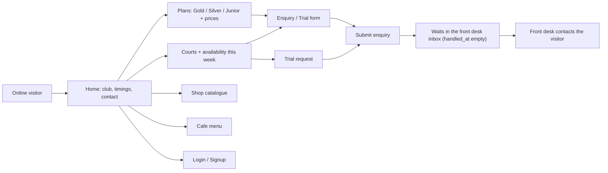
Operations: `public.club`, `memberships.plans`, `courts.list`, `courts.availability`, `shop.products`, `bar.menu`, `enquiries.create`. Tables: `club_settings`, `membership_plans`, `courts`, `court_bookings`, `products`, `bar_menu_items`, `enquiries`.

## 2. Signup / login flow

Role → landing: MEMBER → `/member` · FRONT_DESK → `/front-desk` · KITCHEN_MANAGER → `/kitchen` · STORE_MANAGER → `/store-manager` · OWNER_ADMIN → `/owner`. A person who only has a PENDING job application gets no session: `POST /auth/login` answers `EMPLOYEE_APPLICATION_PENDING` and the app shows `/employee-application-pending`. A user who is not authenticated stays on the public website; private routes and APIs answer `AUTH_UNAUTHORIZED`.

## 3. Member flow
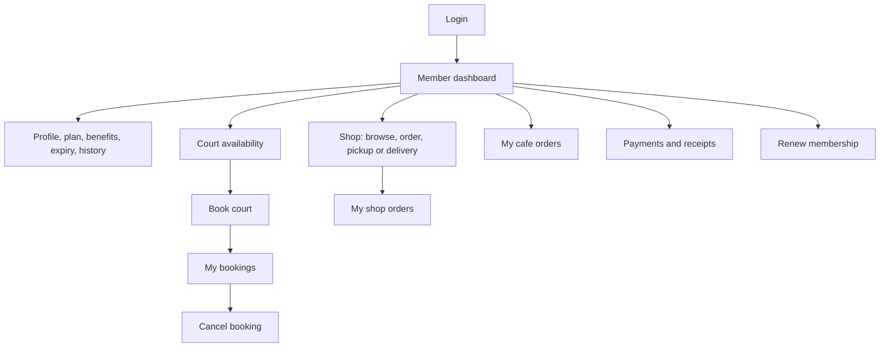
Operations: `members.me`, `members.memberships`, `members.history`, `courts.availability`, `bookings.price/create/list/cancel`, `shop.products/orderCreate/orderList`, `bar.orderList`, `payments.list/get`, `memberships.purchase`. All data scoped to the caller (`member_id`).

## 4. Gold / Silver / Junior behaviour
The UI and API never branch on the type name. Behaviour = the member's **effective membership** → plan columns.

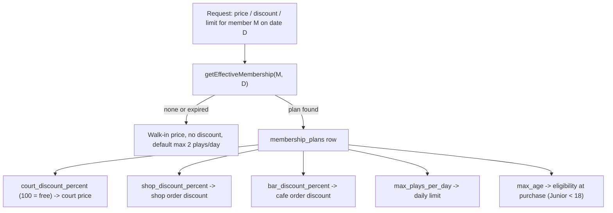
Seed values: Gold 100 % court / 15 % shop / 15 % cafe · Silver 50 % / 10 % / 10 % · Junior 70 % / 5 % / 5 % (all editable by the owner via `memberships.planUpdate`; changing a plan never rewrites past bookings/orders — prices are snapshotted).

## 5. Front desk flow
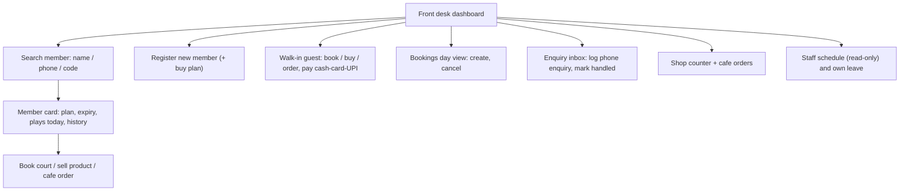
Operations: `members.list/create/get/history`, `memberships.purchase/changePlan/expiring`, `bookings.*`, `enquiries.*`, `shop.orderCreate/orderStatus`, `bar.*`, `staff.shifts`, `staff.leaveCreate`. Front desk does **not** see finance reports, payroll of others, plan/product/menu administration.

## 6. Court booking flow
Rules: R-COURT-01…09. The DB exclusion constraint is the final arbiter.

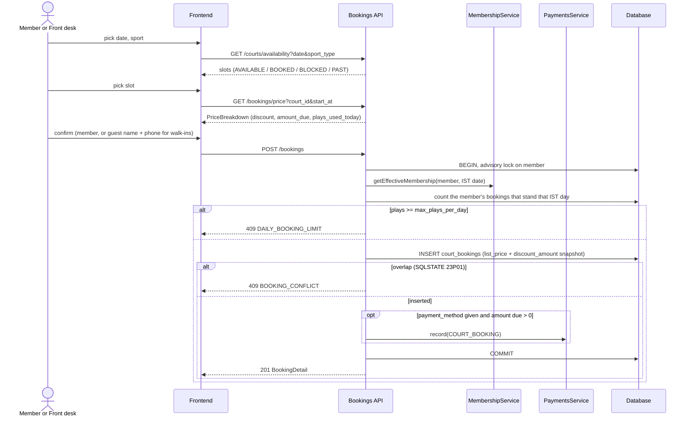
Phone callers: the desk uses the same availability endpoint and `POST /bookings` with `member_id` or `guest_*`. A free trial is a guest booking whose discount equals the list price. Free bookings (Gold) report `payment_status = NOT_REQUIRED` (derived by `court_booking_totals`). Operations: `courts.availability`, `bookings.price`, `bookings.create`, `payments.create` (pay later at the desk).

## 7. Court cancellation flow
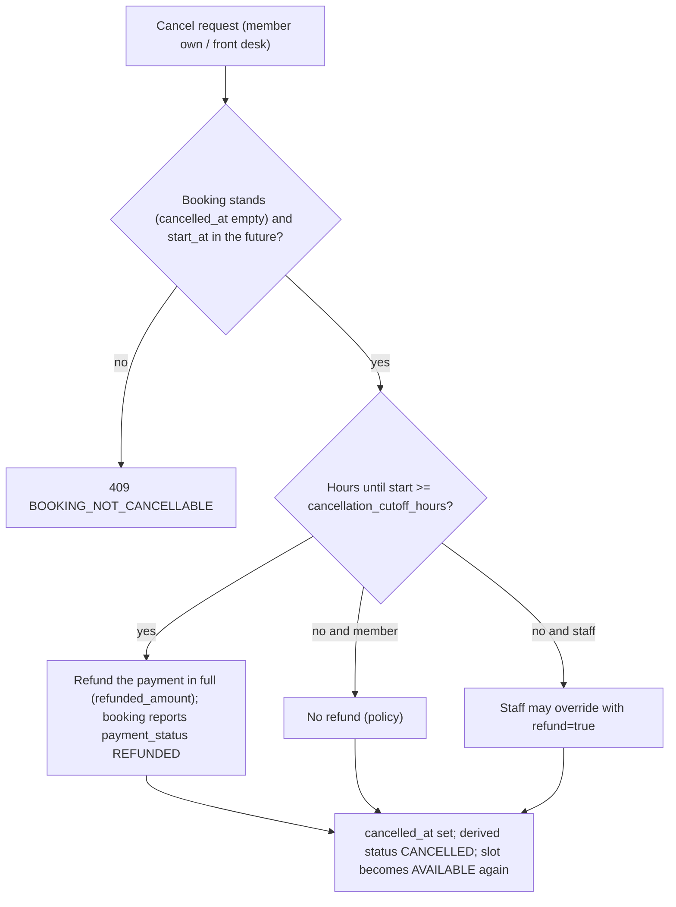
Operations: `bookings.cancel` (calls `PaymentsService.refundSource`). The exclusion constraint only covers bookings with `cancelled_at IS NULL`, so a cancelled row frees the slot instantly.

## 8. Shop — physical purchase flow
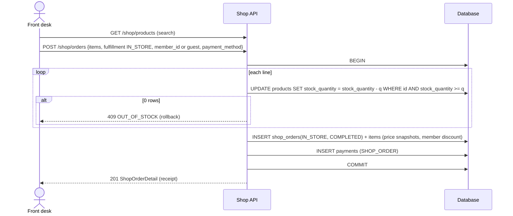
Member discount is applied automatically when the member is identified; guests pay list price. Low stock is read from `inventory.lowStock`: no message is sent.

## 9. Shop — online purchase flow
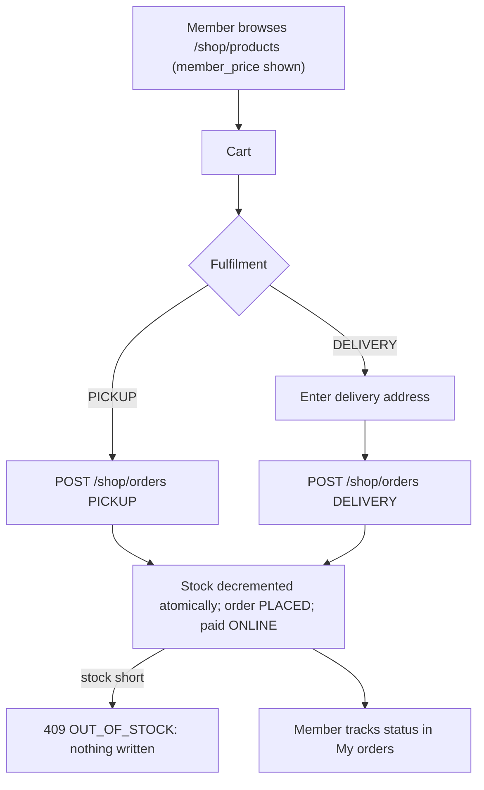
Counter and online orders decrement the **same** `products.stock_quantity` (R-SHOP-01). Delivery fee = `delivery_fee` setting unless the discounted subtotal ≥ `free_delivery_above`.

## 10. Pickup flow
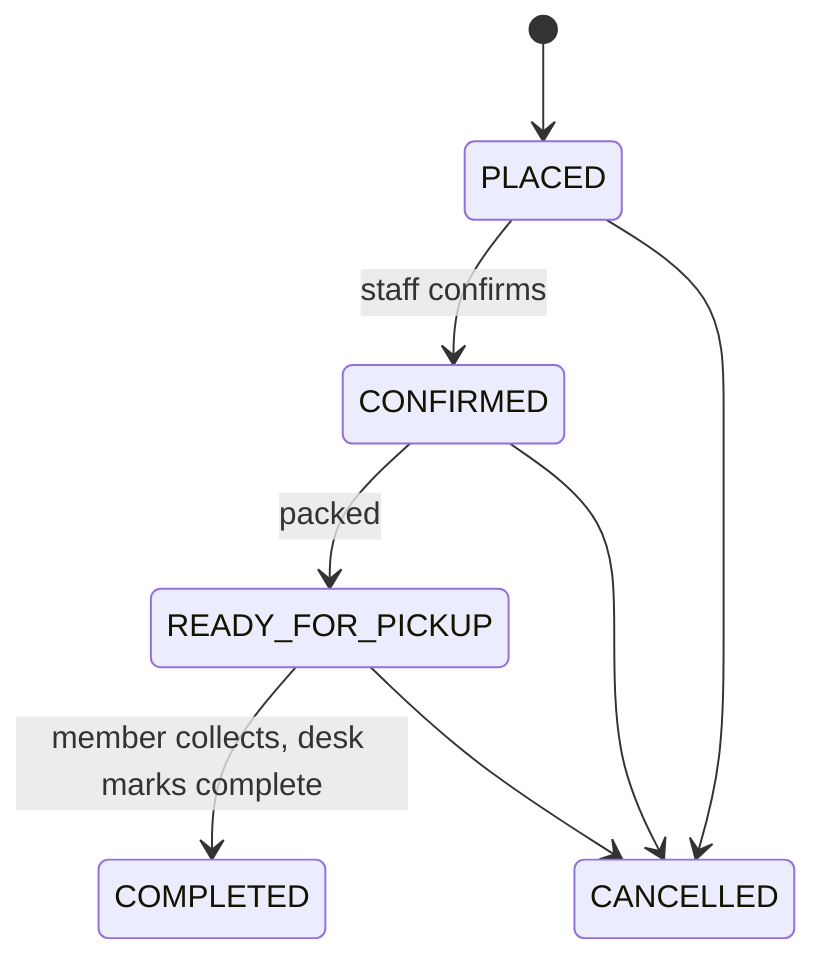
Operations: `shop.orderStatus` (FRONT_DESK/OWNER), `shop.orderCancel`.

## 11. Delivery flow
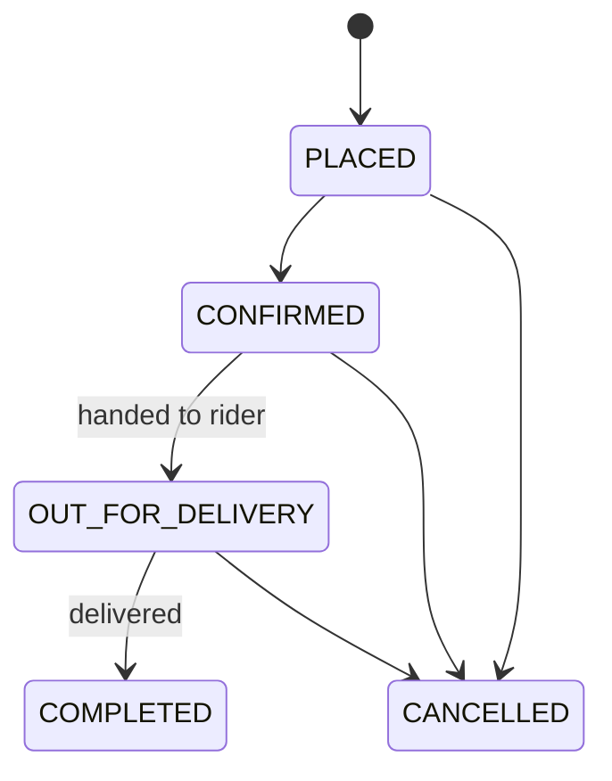
Same endpoints as pickup; `OUT_FOR_DELIVERY` only for `fulfillment = DELIVERY`, `READY_FOR_PICKUP` only for `PICKUP` (server enforces). The delivery address lives on the order (`delivery_address`).

## 12. Cafe order flow
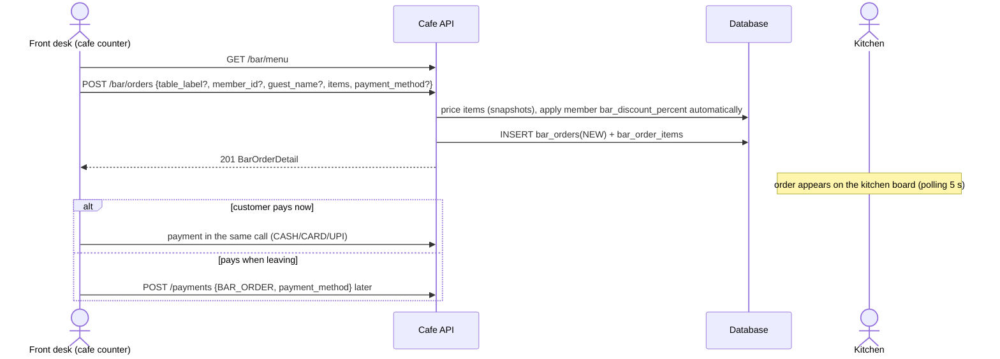
Members never ask for their discount: identifying the member (`member_id`) is enough. The order carries a free-text `table_label`: there are no table or tab records, and every order is paid by itself. Operations: `bar.menu`, `bar.orderCreate`, `bar.orderCancel`, `payments.create`.

## 13. Kitchen flow
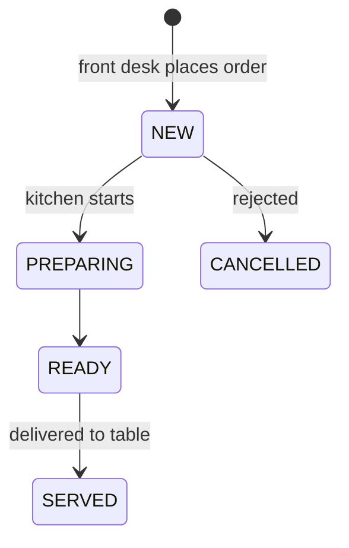
Operations: `kitchen.list` (board, no prices), `kitchen.get`, `kitchen.status`. `bar_orders.status` is the only record of progress. Illegal jumps → `409 INVALID_STATUS_TRANSITION`.

## 14. Enquiry flow
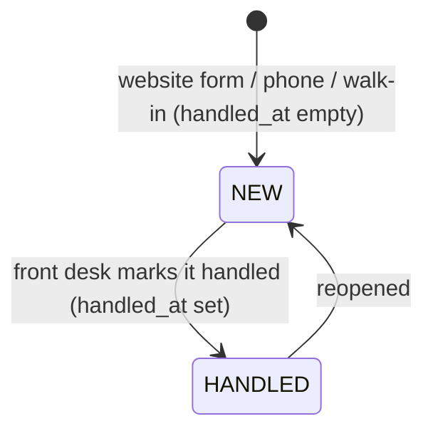
Operations: `enquiries.create` (public or staff), `enquiries.list` (the inbox, filter `handled=false`), `enquiries.get`, `enquiries.update`. Nothing else is modelled: the front desk replies by phone or email and, when the visitor joins, registers them with `members.create`.

## 15. Business-client invoice flow
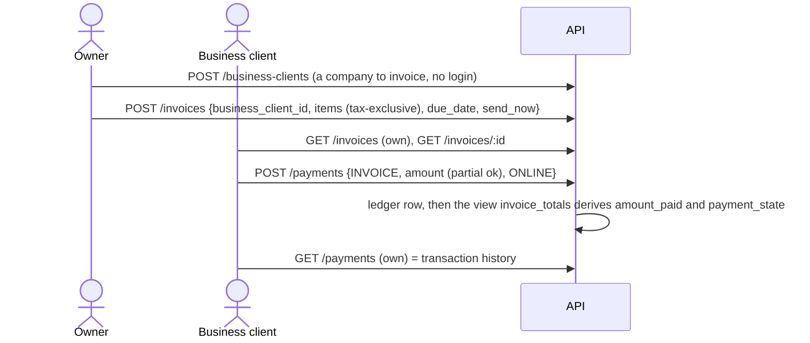
Membership renewal invoices are addressed to a member (`member_id`) instead of a business client (R-FIN-05). Voiding is allowed only with no payments (`invoices.void`). Overdue is derived from `due_date`: no job is needed.

## 16. Owner / admin flow
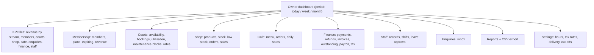
Operations: `reports.*`, plus the admin endpoints of each module (all marked OWNER_ADMIN in the [permissions matrix](../security/PERMISSIONS_MATRIX.md)).

## 17. Staff & leave flow
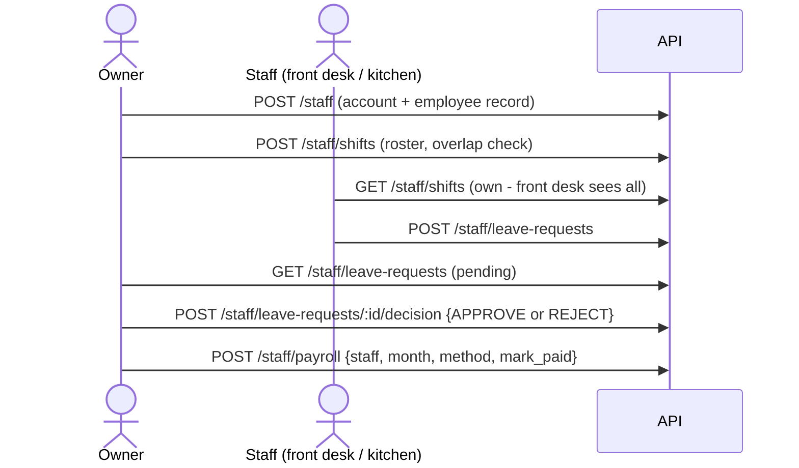
Leave states: `PENDING → APPROVED | REJECTED | CANCELLED`; an approved leave blocks shift assignment on those dates. A salary is pending until `paid_on` is set.

## 18. Finance & reporting flow
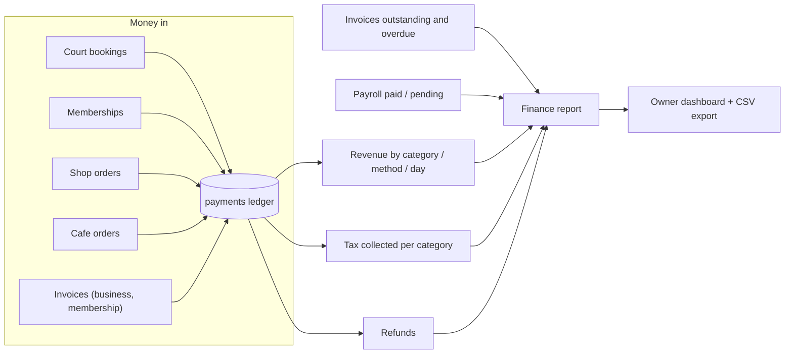
Every figure comes from **ledgers** (`payments`, `invoices`, `payroll_payments`); revenue = `amount − refunded_amount` grouped by IST `paid_at` date, and the revenue category is derived by the view `payment_ledger`. Operations: `reports.dashboard/revenue/courts/memberships/shop/bar/finance/tax/export`, `payments.list`.
