# User Flows

Every flow names the **API operations** it uses (operation id = row in [API_CONTRACT.md](../api/API_CONTRACT.md); `POST /bookings` = `bookings.create`) and the **tables** it touches, so workflows, APIs and database stay aligned. Diagrams are exported to [workflows.mmd](workflows.mmd) (generated). Rules referenced as `R-xx` live in [BUSINESS_RULES.md](../business-rules/BUSINESS_RULES.md).

| # | Flow | Primary actor |
|---|---|---|
| 1 | [Public visitor](#1-public-visitor-flow) | Visitor |
| 2 | [Signup / login](#2-signup--login-flow) | Visitor → any |
| 3 | [Member](#3-member-flow) | Member |
| 4 | [Gold / Silver / Junior behaviour](#4-gold--silver--junior-behaviour) | Member |
| 5 | [Front desk](#5-front-desk-flow) | Front desk |
| 6 | [Court booking](#6-court-booking-flow) | Member / Front desk |
| 7 | [Court cancellation](#7-court-cancellation-flow) | Member / Front desk |
| 8 | [Friday social play](#8-friday-social-play-flow) | Front desk / Member |
| 9 | [Shop — physical purchase](#9-shop--physical-purchase-flow) | Front desk |
| 10 | [Shop — online purchase](#10-shop--online-purchase-flow) | Member |
| 11 | [Pickup](#11-pickup-flow) | Member / Front desk |
| 12 | [Delivery](#12-delivery-flow) | Member / Front desk |
| 13 | [Bar order](#13-bar-order-flow) | Front desk |
| 14 | [Kitchen](#14-kitchen-flow) | Kitchen manager |
| 15 | [Tab settlement](#15-tab-settlement-flow) | Front desk |
| 16 | [Enquiry](#16-enquiry-flow) | Visitor / Front desk |
| 17 | [Trial booking](#17-trial-booking-flow) | Visitor / Front desk |
| 18 | [Business-client invoice](#18-business-client-invoice-flow) | Owner / Business client |
| 19 | [Owner / admin](#19-owner--admin-flow) | Owner |
| 20 | [Staff & leave](#20-staff--leave-flow) | Staff / Owner |
| 21 | [Finance & reporting](#21-finance--reporting-flow) | Owner |

---

## 1. Public visitor flow
Goal: a stranger understands the club and reaches out — without logging in. (FR-PUB-*, FR-ENQ-001/002)

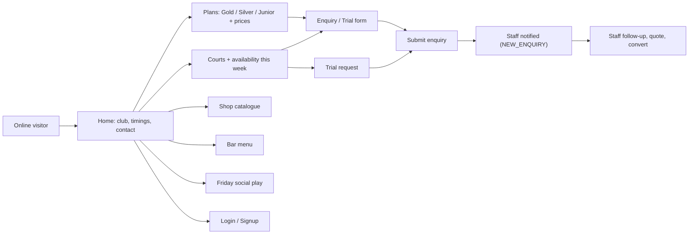
```mermaid
flowchart LR
  V["Online visitor"] --> H["Home: club, timings, contact"]
  H --> P["Plans: Gold / Silver / Junior + prices"]
  H --> C["Courts + availability this week"]
  H --> S["Shop catalogue"]
  H --> B["Bar menu"]
  H --> F["Friday social play"]
  P --> E["Enquiry / Trial form"]
  C --> E
  C --> T["Trial request"]
  E --> SUB["Submit enquiry"]
  T --> SUB
  SUB --> N["Staff notified (NEW_ENQUIRY)"]
  N --> FU["Staff follow-up, quote, convert"]
  H --> L["Login / Signup"]
```
Operations: `public.club`, `memberships.plans`, `courts.list`, `courts.availability`, `shop.products`, `bar.menu`, `social.list`, `enquiries.create`. Tables: `club_settings`, `membership_plans`, `courts`, `court_bookings`, `products`, `bar_menu_items`, `enquiries`, `notifications`.

## 2. Signup / login flow
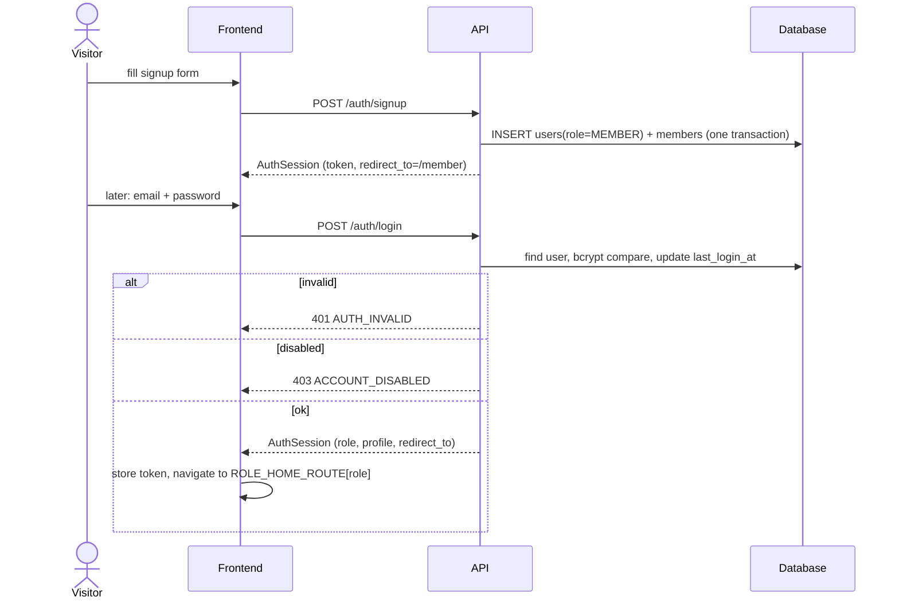
```mermaid
sequenceDiagram
  actor U as Visitor
  participant FE as Frontend
  participant API as API
  participant DB as Database
  U->>FE: fill signup form
  FE->>API: POST /auth/signup
  API->>DB: INSERT users(role=MEMBER) + members (one transaction)
  API-->>FE: AuthSession (token, redirect_to=/member)
  U->>FE: later: email + password
  FE->>API: POST /auth/login
  API->>DB: find user, bcrypt compare, update last_login_at
  alt invalid
    API-->>FE: 401 AUTH_INVALID
  else disabled
    API-->>FE: 403 ACCOUNT_DISABLED
  else ok
    API-->>FE: AuthSession (role, profile, redirect_to)
    FE->>FE: store token, navigate to ROLE_HOME_ROUTE[role]
  end
```
Role → landing: MEMBER → `/member` · FRONT_DESK → `/front-desk` · KITCHEN_MANAGER → `/kitchen` · BUSINESS_CLIENT → `/business` · OWNER_ADMIN → `/owner`. A user who is not authenticated stays on the public site; any private route redirects to `/login` and any private API answers `401 AUTH_UNAUTHORIZED`. Staff-created accounts (`must_change_password = true`) are forced through `auth.changePassword` first. Operations: `auth.signup`, `auth.login`, `auth.me`, `auth.logout`, `auth.changePassword`.

## 3. Member flow
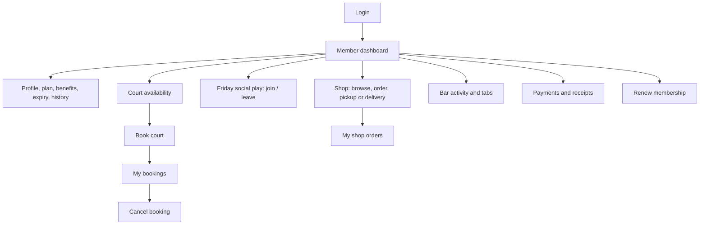
```mermaid
flowchart TB
  L["Login"] --> D["Member dashboard"]
  D --> PR["Profile, plan, benefits, expiry, history"]
  D --> AV["Court availability"] --> BK["Book court"] --> MB["My bookings"] --> CN["Cancel booking"]
  D --> SP["Friday social play: join / leave"]
  D --> SH["Shop: browse, order, pickup or delivery"] --> SO["My shop orders"]
  D --> BA["Bar activity and tabs"]
  D --> PY["Payments and receipts"]
  D --> RN["Renew membership"]
```
Operations: `members.me`, `members.memberships`, `members.history`, `courts.availability`, `bookings.price/create/list/cancel`, `social.list/join/leave`, `shop.products/orderCreate/orderList`, `bar.orderList/tabList`, `payments.list/get`, `memberships.purchase`, `notifications.*`. All data scoped to the caller (`member_id`).

## 4. Gold / Silver / Junior behaviour
The UI and API never branch on the type name. Behaviour = the member's **effective membership** → plan columns.

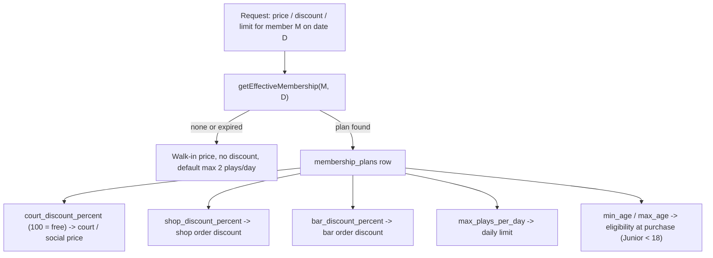
```mermaid
flowchart TB
  A["Request: price / discount / limit for member M on date D"] --> Q["getEffectiveMembership(M, D)"]
  Q -->|none or expired| W["Walk-in price, no discount, default max 2 plays/day"]
  Q -->|plan found| P["membership_plans row"]
  P --> C1["court_discount_percent (100 = free) -> court / social price"]
  P --> C2["shop_discount_percent -> shop order discount"]
  P --> C3["bar_discount_percent -> bar order discount"]
  P --> C4["max_plays_per_day -> daily limit"]
  P --> C5["min_age / max_age -> eligibility at purchase (Junior < 18)"]
```
Seed values: Gold 100 % court / 15 % shop / 15 % bar · Silver 50 % / 10 % / 10 % · Junior 70 % / 5 % / 5 % (all editable by the owner via `memberships.planUpdate`; changing a plan never rewrites past bookings/orders — prices are snapshotted).

## 5. Front desk flow
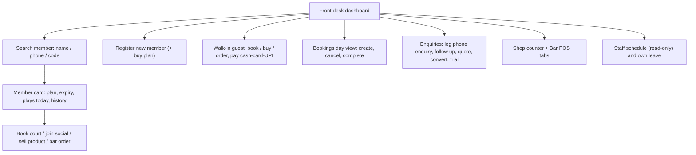
```mermaid
flowchart TB
  FD["Front desk dashboard"] --> M1["Search member: name / phone / code"]
  M1 --> M2["Member card: plan, expiry, plays today, history"]
  M2 --> M3["Book court / join social / sell product / bar order"]
  FD --> R["Register new member (+ buy plan)"]
  FD --> W["Walk-in guest: book / buy / order, pay cash-card-UPI"]
  FD --> BKV["Bookings day view: create, cancel, complete"]
  FD --> E["Enquiries: log phone enquiry, follow up, quote, convert, trial"]
  FD --> POS["Shop counter + Bar POS + tabs"]
  FD --> SC["Staff schedule (read-only) and own leave"]
```
Operations: `members.list/create/get/history`, `memberships.purchase/changePlan/expiring`, `bookings.*`, `social.*`, `enquiries.*`, `shop.orderCreate/orderStatus`, `bar.*`, `staff.shifts`, `staff.leaveCreate`. Front desk does **not** see finance reports, payroll of others, plan/product/menu administration.

## 6. Court booking flow
Rules: R-COURT-01…09. The DB exclusion constraint is the final arbiter.

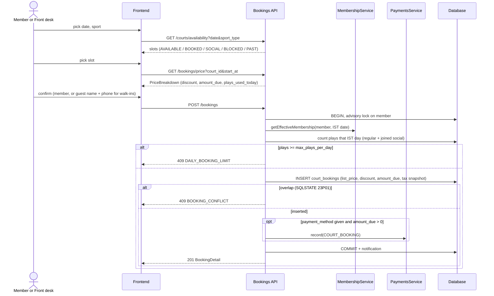
```mermaid
sequenceDiagram
  actor U as Member or Front desk
  participant FE as Frontend
  participant API as Bookings API
  participant MS as MembershipService
  participant PS as PaymentsService
  participant DB as Database
  U->>FE: pick date, sport
  FE->>API: GET /courts/availability?date&sport_type
  API-->>FE: slots (AVAILABLE / BOOKED / SOCIAL / BLOCKED / PAST)
  U->>FE: pick slot
  FE->>API: GET /bookings/price?court_id&start_at
  API-->>FE: PriceBreakdown (discount, amount_due, plays_used_today)
  U->>FE: confirm (member, or guest name + phone for walk-ins)
  FE->>API: POST /bookings
  API->>DB: BEGIN, advisory lock on member
  API->>MS: getEffectiveMembership(member, IST date)
  API->>DB: count plays that IST day (regular + joined social)
  alt plays >= max_plays_per_day
    API-->>FE: 409 DAILY_BOOKING_LIMIT
  else
    API->>DB: INSERT court_bookings (list_price, discount, amount_due, tax snapshot)
    alt overlap (SQLSTATE 23P01)
      API-->>FE: 409 BOOKING_CONFLICT
    else inserted
      opt payment_method given and amount_due > 0
        API->>PS: record(COURT_BOOKING)
      end
      API->>DB: COMMIT + notification
      API-->>FE: 201 BookingDetail
    end
  end
```
Phone callers: the desk uses the same availability endpoint and `POST /bookings` with `member_id` or `guest_*`. Free bookings (Gold) get `payment_status = NOT_REQUIRED`. Operations: `courts.availability`, `bookings.price`, `bookings.create`, `payments.create` (pay later at the desk).

## 7. Court cancellation flow
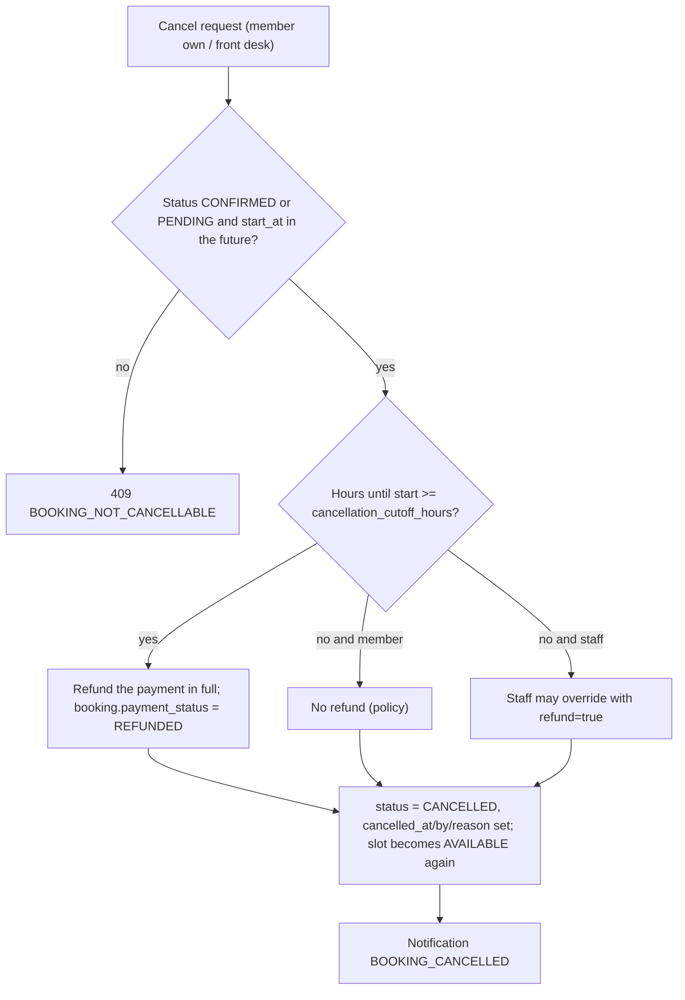
```mermaid
flowchart TB
  S["Cancel request (member own / front desk)"] --> C1{"Status CONFIRMED or PENDING and start_at in the future?"}
  C1 -->|no| X["409 BOOKING_NOT_CANCELLABLE"]
  C1 -->|yes| C2{"Hours until start >= cancellation_cutoff_hours?"}
  C2 -->|yes| R["Refund the payment in full; booking.payment_status = REFUNDED"]
  C2 -->|no and member| N["No refund (policy)"]
  C2 -->|no and staff| O["Staff may override with refund=true"]
  R --> F["status = CANCELLED, cancelled_at/by/reason set; slot becomes AVAILABLE again"]
  N --> F
  O --> F
  F --> NT["Notification BOOKING_CANCELLED"]
```
Operations: `bookings.cancel` (calls `PaymentsService.refundSource`). The exclusion constraint only covers live statuses, so a cancelled row frees the slot instantly. Related: a social-session participant leaving uses `social.leave`.

## 8. Friday social-play flow
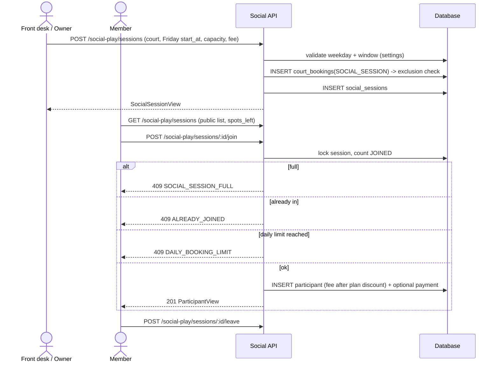
```mermaid
sequenceDiagram
  actor FD as Front desk / Owner
  actor M as Member
  participant API as Social API
  participant DB as Database
  FD->>API: POST /social-play/sessions (court, Friday start_at, capacity, fee)
  API->>DB: validate weekday + window (settings)
  API->>DB: INSERT court_bookings(SOCIAL_SESSION) -> exclusion check
  API->>DB: INSERT social_sessions
  API-->>FD: SocialSessionView
  M->>API: GET /social-play/sessions (public list, spots_left)
  M->>API: POST /social-play/sessions/:id/join
  API->>DB: lock session, count JOINED
  alt full
    API-->>M: 409 SOCIAL_SESSION_FULL
  else already in
    API-->>M: 409 ALREADY_JOINED
  else daily limit reached
    API-->>M: 409 DAILY_BOOKING_LIMIT
  else ok
    API->>DB: INSERT participant (fee after plan discount) + optional payment
    API-->>M: 201 ParticipantView
  end
  M->>API: POST /social-play/sessions/:id/leave
```
Because the session owns a `SOCIAL_SESSION` booking, the same court cannot be taken by a regular booking in that hour (FR-SOC-005). Walk-in guests join through the front desk (`guest_name`, `guest_phone`). Cancelling the whole session (`social.cancel`) cancels the hold and refunds everyone.

## 9. Shop — physical purchase flow
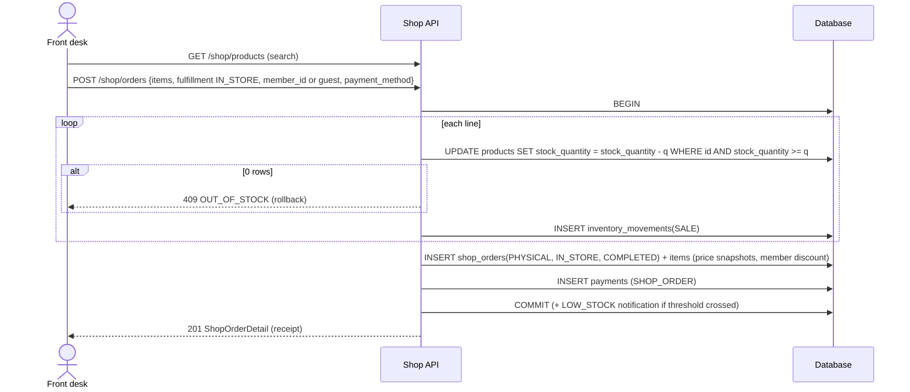
```mermaid
sequenceDiagram
  actor FD as Front desk
  participant API as Shop API
  participant DB as Database
  FD->>API: GET /shop/products (search)
  FD->>API: POST /shop/orders {items, fulfillment IN_STORE, member_id or guest, payment_method}
  API->>DB: BEGIN
  loop each line
    API->>DB: UPDATE products SET stock_quantity = stock_quantity - q WHERE id AND stock_quantity >= q
    alt 0 rows
      API-->>FD: 409 OUT_OF_STOCK (rollback)
    end
    API->>DB: INSERT inventory_movements(SALE)
  end
  API->>DB: INSERT shop_orders(PHYSICAL, IN_STORE, COMPLETED) + items (price snapshots, member discount)
  API->>DB: INSERT payments (SHOP_ORDER)
  API->>DB: COMMIT (+ LOW_STOCK notification if threshold crossed)
  API-->>FD: 201 ShopOrderDetail (receipt)
```
Member discount is applied automatically when the member is identified; guests pay list price.

## 10. Shop — online purchase flow
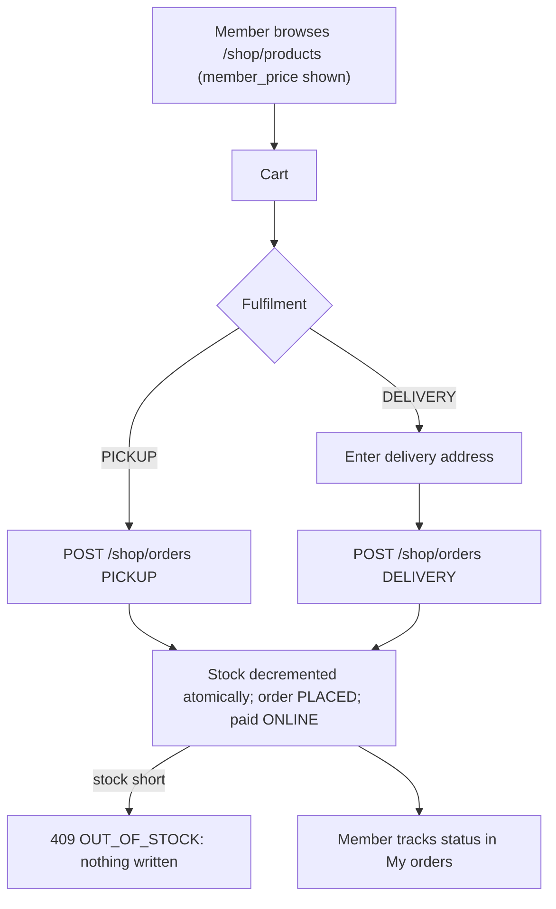
```mermaid
flowchart TB
  M["Member browses /shop/products (member_price shown)"] --> CART["Cart"]
  CART --> CH{"Fulfilment"}
  CH -->|PICKUP| PO["POST /shop/orders PICKUP"]
  CH -->|DELIVERY| AD["Enter delivery address"] --> DO["POST /shop/orders DELIVERY"]
  PO --> OK["Stock decremented atomically; order PLACED; paid ONLINE"]
  DO --> OK
  OK -->|stock short| ERR["409 OUT_OF_STOCK: nothing written"]
  OK --> TR["Member tracks status in My orders"]
```
Both channels decrement the **same** `products.stock_quantity` (R-SHOP-01). Delivery fee = `delivery_fee` setting unless the discounted subtotal ≥ `free_delivery_above`.

## 11. Pickup flow
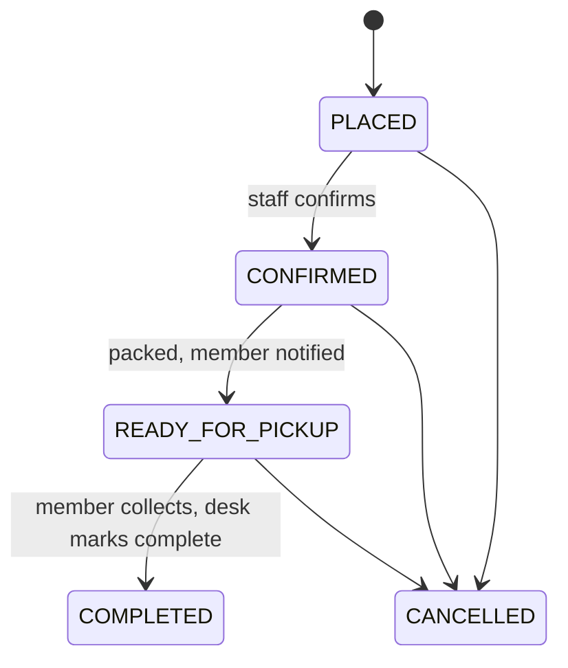
```mermaid
stateDiagram-v2
  [*] --> PLACED
  PLACED --> CONFIRMED : staff confirms
  CONFIRMED --> READY_FOR_PICKUP : packed, member notified
  READY_FOR_PICKUP --> COMPLETED : member collects, desk marks complete
  PLACED --> CANCELLED
  CONFIRMED --> CANCELLED
  READY_FOR_PICKUP --> CANCELLED
```
Operations: `shop.orderStatus` (FRONT_DESK/OWNER), `shop.orderCancel`. Notifications `SHOP_ORDER_UPDATE` on each step.

## 12. Delivery flow
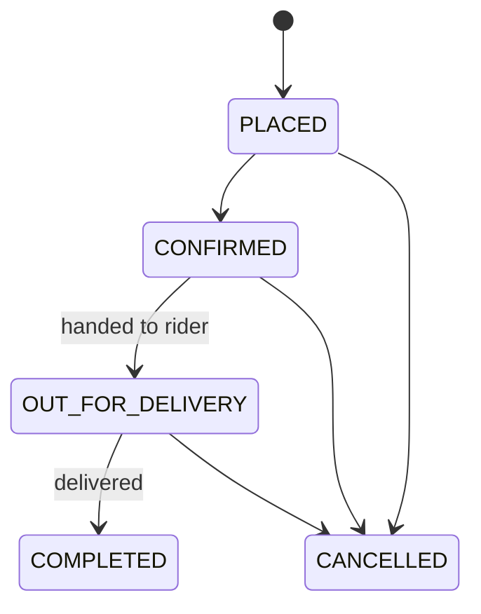
```mermaid
stateDiagram-v2
  [*] --> PLACED
  PLACED --> CONFIRMED
  CONFIRMED --> OUT_FOR_DELIVERY : handed to rider
  OUT_FOR_DELIVERY --> COMPLETED : delivered
  PLACED --> CANCELLED
  CONFIRMED --> CANCELLED
  OUT_FOR_DELIVERY --> CANCELLED
```
Same endpoints as pickup; `OUT_FOR_DELIVERY` only for `fulfillment = DELIVERY`, `READY_FOR_PICKUP` only for `PICKUP` (server enforces). The delivery address lives on the order (`delivery_address`).

## 13. Bar order flow
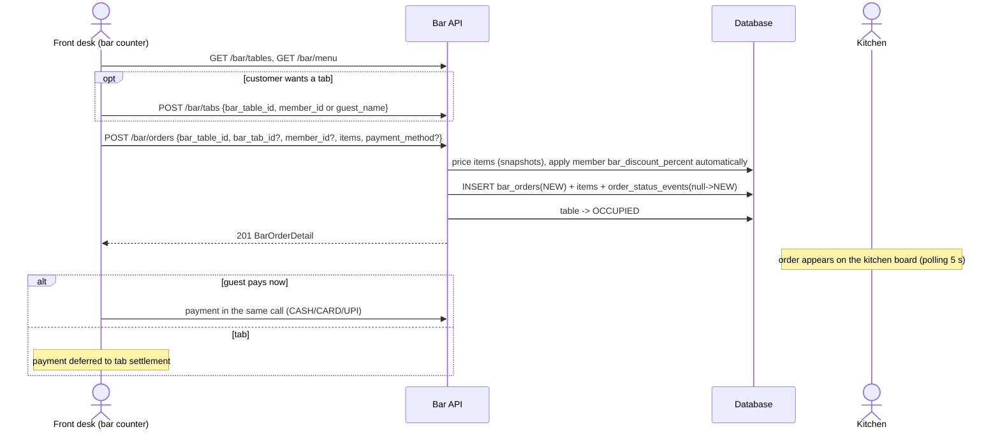
```mermaid
sequenceDiagram
  actor FD as Front desk (bar counter)
  participant API as Bar API
  participant DB as Database
  actor K as Kitchen
  FD->>API: GET /bar/tables, GET /bar/menu
  opt customer wants a tab
    FD->>API: POST /bar/tabs {bar_table_id, member_id or guest_name}
  end
  FD->>API: POST /bar/orders {bar_table_id, bar_tab_id?, member_id?, items, payment_method?}
  API->>DB: price items (snapshots), apply member bar_discount_percent automatically
  API->>DB: INSERT bar_orders(NEW) + items + order_status_events(null->NEW)
  API->>DB: table -> OCCUPIED
  API-->>FD: 201 BarOrderDetail
  Note over K: order appears on the kitchen board (polling 5 s)
  alt guest pays now
    FD->>API: payment in the same call (CASH/CARD/UPI)
  else tab
    Note over FD: payment deferred to tab settlement
  end
```
Members never ask for their discount: identifying the member (`member_id`, or the tab's member) is enough. Operations: `bar.tables`, `bar.menu`, `bar.tabOpen`, `bar.orderCreate`, `bar.orderCancel`.

## 14. Kitchen flow
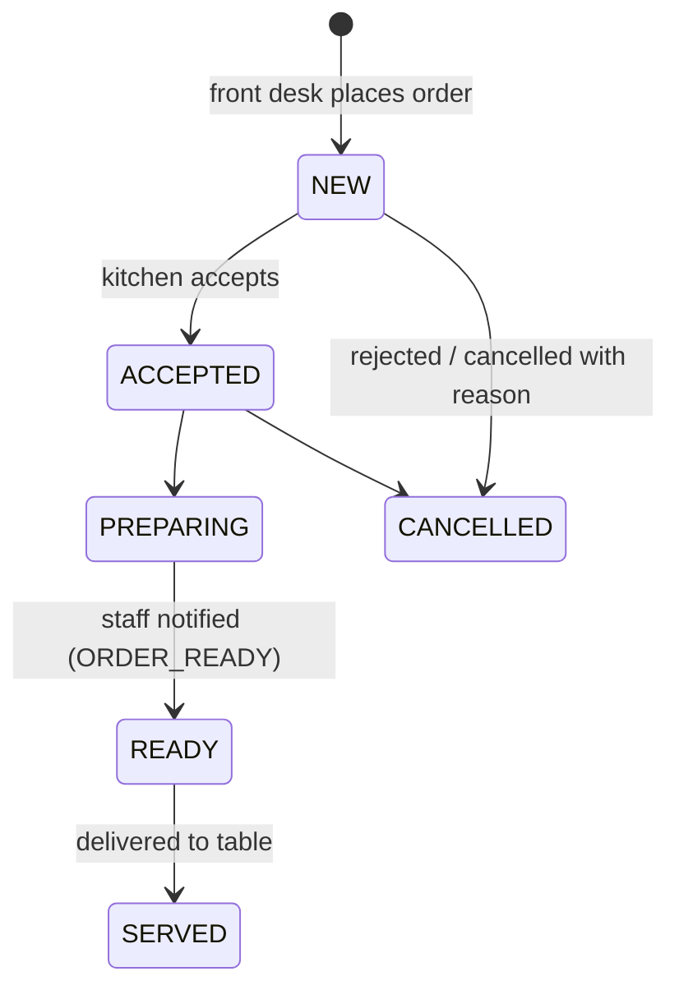
```mermaid
stateDiagram-v2
  [*] --> NEW : front desk places order
  NEW --> ACCEPTED : kitchen accepts
  ACCEPTED --> PREPARING
  PREPARING --> READY : staff notified (ORDER_READY)
  READY --> SERVED : delivered to table
  NEW --> CANCELLED : rejected / cancelled with reason
  ACCEPTED --> CANCELLED
```
Operations: `kitchen.list` (board, no prices), `kitchen.get`, `kitchen.status`. Each transition writes `order_status_events` and sets `ready_at` / `served_at`. Illegal jumps → `409 INVALID_STATUS_TRANSITION`.

## 15. Tab settlement flow
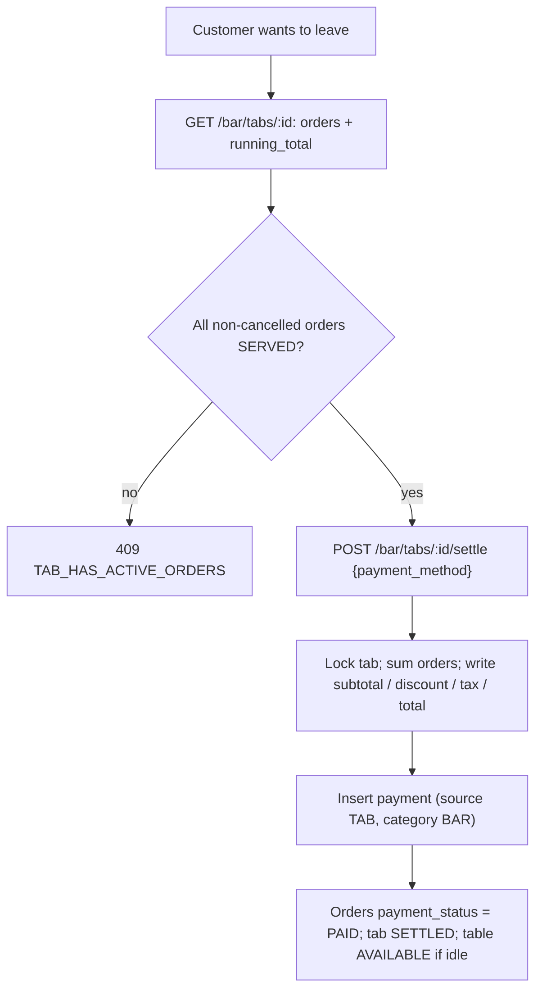
```mermaid
flowchart TB
  S["Customer wants to leave"] --> G["GET /bar/tabs/:id: orders + running_total"]
  G --> Q{"All non-cancelled orders SERVED?"}
  Q -->|no| E["409 TAB_HAS_ACTIVE_ORDERS"]
  Q -->|yes| P["POST /bar/tabs/:id/settle {payment_method}"]
  P --> T["Lock tab; sum orders; write subtotal / discount / tax / total"]
  T --> Y["Insert payment (source TAB, category BAR)"]
  Y --> Z["Orders payment_status = PAID; tab SETTLED; table AVAILABLE if idle"]
```
The amount is computed by the server from the orders; the client cannot change it. Voiding an empty tab: `bar.tabVoid` (owner).

## 16. Enquiry flow
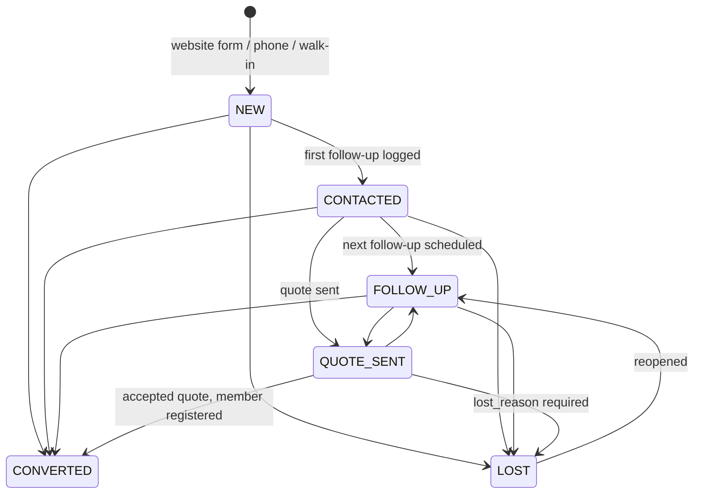
```mermaid
stateDiagram-v2
  [*] --> NEW : website form / phone / walk-in
  NEW --> CONTACTED : first follow-up logged
  CONTACTED --> FOLLOW_UP : next follow-up scheduled
  CONTACTED --> QUOTE_SENT : quote sent
  FOLLOW_UP --> QUOTE_SENT
  QUOTE_SENT --> FOLLOW_UP
  NEW --> CONVERTED
  CONTACTED --> CONVERTED
  FOLLOW_UP --> CONVERTED
  QUOTE_SENT --> CONVERTED : accepted quote, member registered
  NEW --> LOST
  CONTACTED --> LOST
  FOLLOW_UP --> LOST
  QUOTE_SENT --> LOST : lost_reason required
  LOST --> FOLLOW_UP : reopened
```
Operations: `enquiries.create` (public or staff), `enquiries.list/get/update`, `enquiries.followUp`, `enquiries.quoteCreate`, `enquiries.quoteUpdate`, `enquiries.convert`, `enquiries.summary`. Creating an enquiry notifies every active front-desk and owner user. `convert` runs member registration + membership purchase + payment in one transaction and marks the accepted quote.

## 17. Trial booking flow
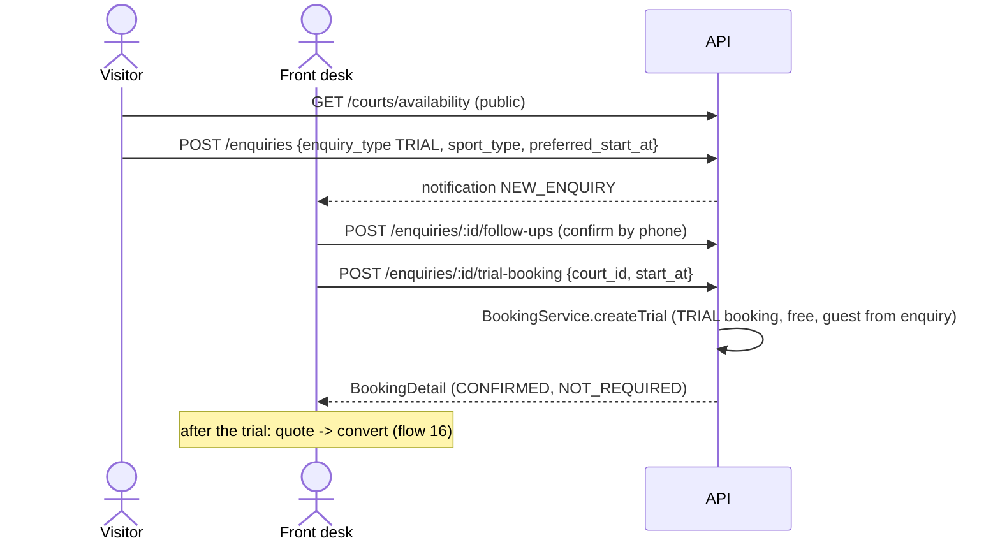
```mermaid
sequenceDiagram
  actor V as Visitor
  actor FD as Front desk
  participant API as API
  V->>API: GET /courts/availability (public)
  V->>API: POST /enquiries {enquiry_type TRIAL, sport_type, preferred_start_at}
  API-->>FD: notification NEW_ENQUIRY
  FD->>API: POST /enquiries/:id/follow-ups (confirm by phone)
  FD->>API: POST /enquiries/:id/trial-booking {court_id, start_at}
  API->>API: BookingService.createTrial (TRIAL booking, free, guest from enquiry)
  API-->>FD: BookingDetail (CONFIRMED, NOT_REQUIRED)
  Note over FD: after the trial: quote -> convert (flow 16)
```
A trial booking counts as court occupancy (blocked for others) but does not count toward any member's daily limit (guest).

## 18. Business-client invoice flow
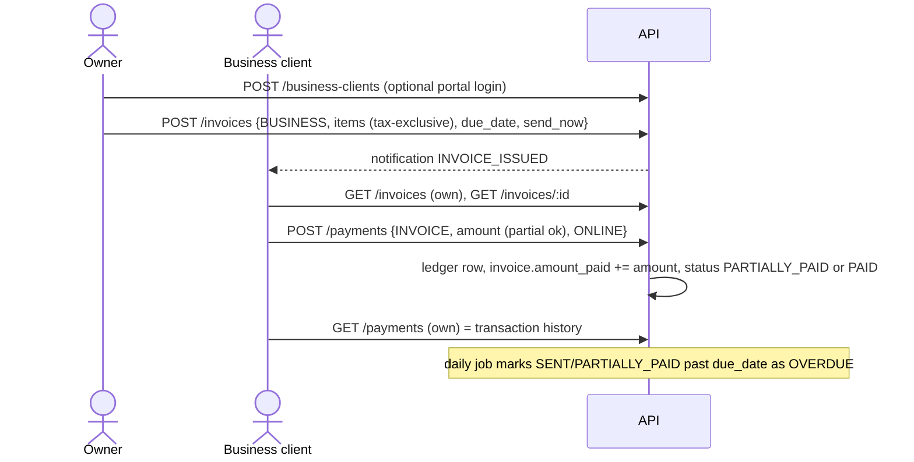
```mermaid
sequenceDiagram
  actor O as Owner
  actor B as Business client
  participant API as API
  O->>API: POST /business-clients (optional portal login)
  O->>API: POST /invoices {BUSINESS, items (tax-exclusive), due_date, send_now}
  API-->>B: notification INVOICE_ISSUED
  B->>API: GET /invoices (own), GET /invoices/:id
  B->>API: POST /payments {INVOICE, amount (partial ok), ONLINE}
  API->>API: ledger row, invoice.amount_paid += amount, status PARTIALLY_PAID or PAID
  B->>API: GET /payments (own) = transaction history
  Note over API: daily job marks SENT/PARTIALLY_PAID past due_date as OVERDUE
```
Membership renewal invoices use `invoice_type = MEMBERSHIP` with `member_id` (R-FIN-05). Voiding is allowed only with no payments (`invoices.void`).

## 19. Owner / admin flow
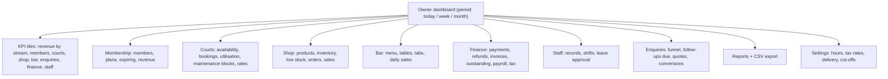
```mermaid
flowchart TB
  O["Owner dashboard (period: today / week / month)"] --> K["KPI tiles: revenue by stream, members, courts, shop, bar, enquiries, finance, staff"]
  O --> A1["Membership: members, plans, expiring, revenue"]
  O --> A2["Courts: availability, bookings, utilisation, maintenance blocks, rates"]
  O --> A3["Shop: products, inventory, low stock, orders, sales"]
  O --> A4["Bar: menu, tables, tabs, daily sales"]
  O --> A5["Finance: payments, refunds, invoices, outstanding, payroll, tax"]
  O --> A6["Staff: records, shifts, leave approval"]
  O --> A7["Enquiries: funnel, follow-ups due, quotes, conversions"]
  O --> A8["Reports + CSV export"]
  O --> A9["Settings: hours, tax rates, delivery, cut-offs"]
```
Operations: `reports.*`, plus the admin endpoints of each module (all marked OWNER_ADMIN in the [permissions matrix](../security/PERMISSIONS_MATRIX.md)).

## 20. Staff & leave flow
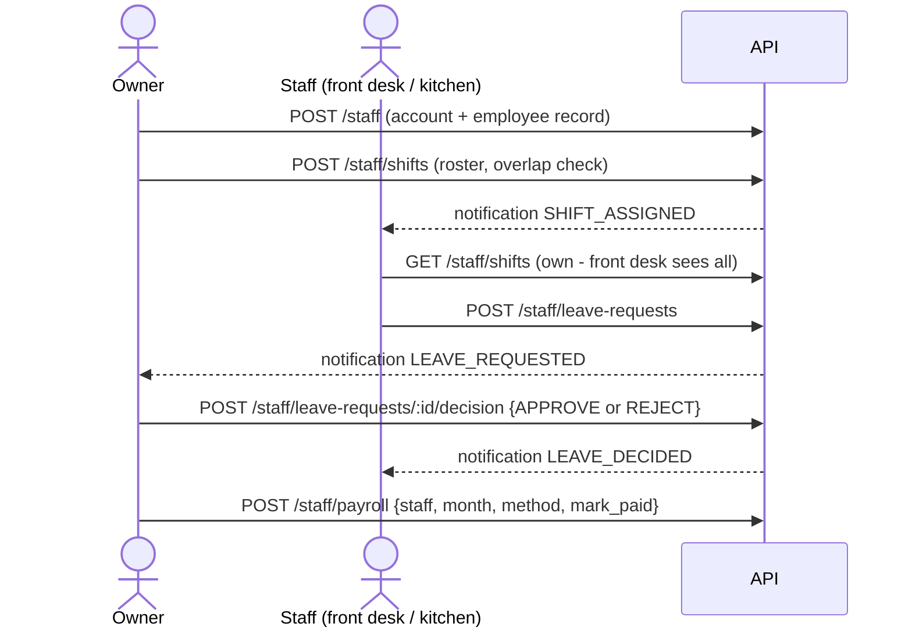
```mermaid
sequenceDiagram
  actor O as Owner
  actor S as Staff (front desk / kitchen)
  participant API as API
  O->>API: POST /staff (account + employee record)
  O->>API: POST /staff/shifts (roster, overlap check)
  API-->>S: notification SHIFT_ASSIGNED
  S->>API: GET /staff/shifts (own - front desk sees all)
  S->>API: POST /staff/leave-requests
  API-->>O: notification LEAVE_REQUESTED
  O->>API: POST /staff/leave-requests/:id/decision {APPROVE or REJECT}
  API-->>S: notification LEAVE_DECIDED
  O->>API: POST /staff/payroll {staff, month, method, mark_paid}
```
Leave states: `PENDING → APPROVED | REJECTED | CANCELLED`; an approved leave blocks shift assignment on those dates.

## 21. Finance & reporting flow
```mermaid
flowchart LR
  subgraph IN["Money in"]
    C["Court bookings and social play"] --> P[("payments ledger")]
    M["Memberships"] --> P
    S["Shop orders"] --> P
    B["Bar orders and tabs"] --> P
    I["Invoices (business, membership)"] --> P
  end
  P --> R["Revenue by category / method / day"]
  P --> T["Tax collected per category"]
  P --> RF["Refunds"]
  INV["Invoices outstanding and overdue"] --> F["Finance report"]
  PR["Payroll paid / pending"] --> F
  R --> F
  T --> F
  RF --> F
  F --> D["Owner dashboard + CSV export"]
```
Every figure comes from **ledgers** (`payments`, `invoices`, `payroll_payments`); revenue = `amount − refunded_amount` of succeeded payments grouped by IST `paid_at` date. Operations: `reports.dashboard/revenue/courts/memberships/shop/bar/finance/tax/export`, `payments.list`.
